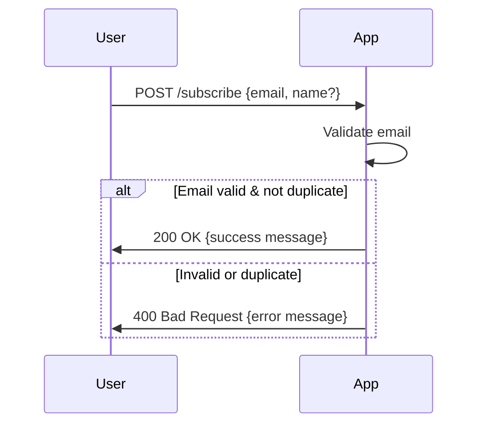
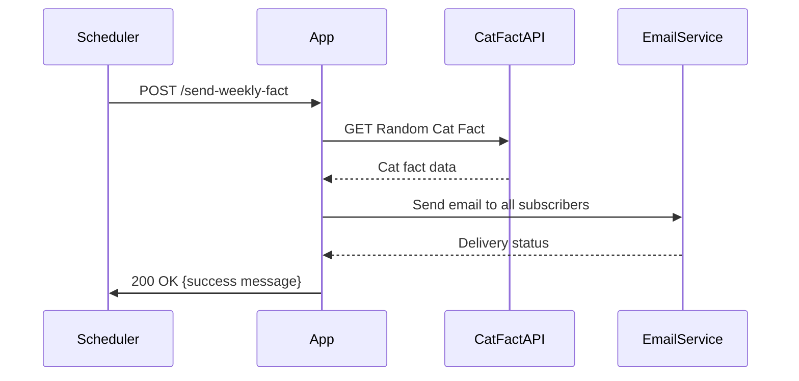
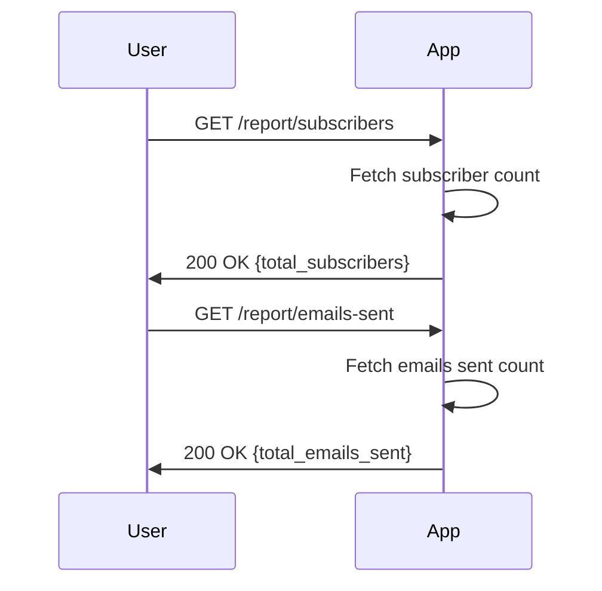

```markdown
# Weekly Cat Fact Subscription - Functional Requirements and API Design

## Functional Requirements

1. **User Signup**
   - Allow users to subscribe by providing their email (and optionally name).
   - Validate email format.
   - Prevent duplicate subscriptions.

2. **Unsubscribe**
   - Allow users to unsubscribe using their email.

3. **Weekly Cat Fact Retrieval & Email Sending**
   - Scheduled task triggers retrieval of a new cat fact from the external API.
   - Send the cat fact email to all subscribers.
   - Track email sending success/failure.

4. **Reporting**
   - Retrieve total number of subscribers.
   - Retrieve total number of cat facts sent.

---

## API Endpoints

### 1. Subscribe User

- **POST** `/subscribe`
- **Request Body** (JSON):
  ```json
  {
    "email": "user@example.com",
    "name": "Optional Name"
  }
  ```
- **Response** (JSON):
  ```json
  {
    "status": "success",
    "message": "Subscription successful"
  }
  ```

### 2. Unsubscribe User

- **POST** `/unsubscribe`
- **Request Body** (JSON):
  ```json
  {
    "email": "user@example.com"
  }
  ```
- **Response** (JSON):
  ```json
  {
    "status": "success",
    "message": "Unsubscribed successfully"
  }
  ```

### 3. Trigger Weekly Fact Retrieval and Email Sending

- **POST** `/send-weekly-fact`
- **Request Body**: *No body required*
- **Response** (JSON):
  ```json
  {
    "status": "success",
    "message": "Weekly cat fact sent to subscribers"
  }
  ```

### 4. Get Reporting Data

- **GET** `/report/subscribers`
- **Response** (JSON):
  ```json
  {
    "total_subscribers": 123
  }
  ```

- **GET** `/report/emails-sent`
- **Response** (JSON):
  ```json
  {
    "total_emails_sent": 45
  }
  ```

---

## User-App Interaction Diagrams

### User Subscription Flow



### Weekly Fact Retrieval and Email Sending Flow



### Reporting Data Retrieval


```