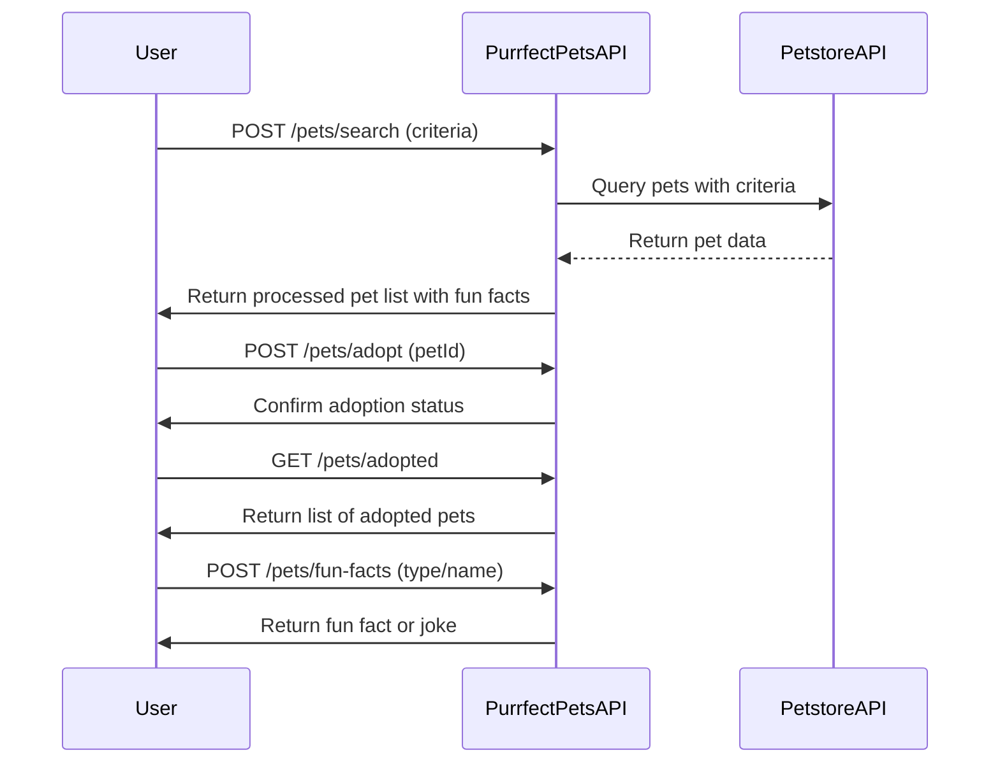

```markdown
# Purrfect Pets API - Functional Requirements

## Overview
The API uses Petstore API data to provide pet-related functionality. Business logic interacting with the external Petstore API or performing calculations is handled in POST endpoints. GET endpoints retrieve stored or processed results.

---

## API Endpoints

### 1. POST /pets/search  
**Description:** Search pets in the external Petstore API based on criteria (type, status, name). Retrieves data from Petstore and processes it.  
**Request:**  
```json
{
  "type": "string (optional, e.g. cat, dog)",
  "status": "string (optional, e.g. available, pending, sold)",
  "name": "string (optional, partial or full pet name)"
}
```  
**Response:**  
```json
{
  "pets": [
    {
      "id": "integer",
      "name": "string",
      "type": "string",
      "status": "string",
      "description": "string (fun fact or joke)",
      "imageUrl": "string (optional)"
    }
  ]
}
```

---

### 2. POST /pets/adopt  
**Description:** Mark a pet as adopted (updates internal adoption status). Business logic validates pet availability.  
**Request:**  
```json
{
  "petId": "integer"
}
```  
**Response:**  
```json
{
  "success": true,
  "message": "string (confirmation or error message)"
}
```

---

### 3. GET /pets/adopted  
**Description:** Retrieve a list of pets adopted by users (stored internally).  
**Response:**  
```json
{
  "adoptedPets": [
    {
      "id": "integer",
      "name": "string",
      "type": "string",
      "adoptionDate": "string (ISO date)",
      "message": "string (fun adoption note)"
    }
  ]
}
```

---

### 4. POST /pets/fun-facts  
**Description:** Generate or retrieve a fun fact or joke about a specific pet type or name.  
**Request:**  
```json
{
  "type": "string (optional)",
  "name": "string (optional)"
}
```  
**Response:**  
```json
{
  "fact": "string"
}
```

---

## User-App Interaction Sequence



---

## Notes  
- POST endpoints handle all external data fetching and business logic.  
- GET endpoints only return stored or computed results.  
- Fun facts/jokes add a playful aspect to the app for a better user experience.  
- Adoption status is maintained internally to simulate pet adoption.
```
