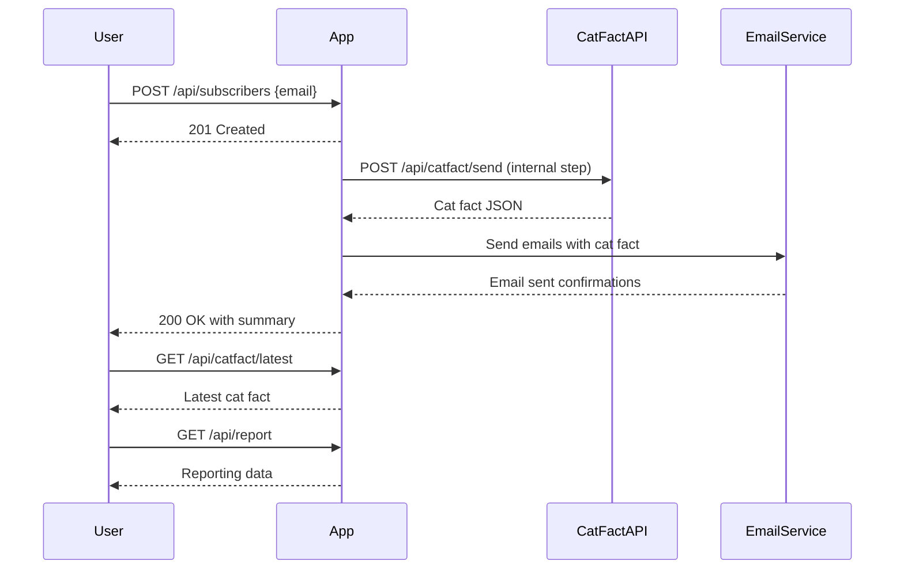
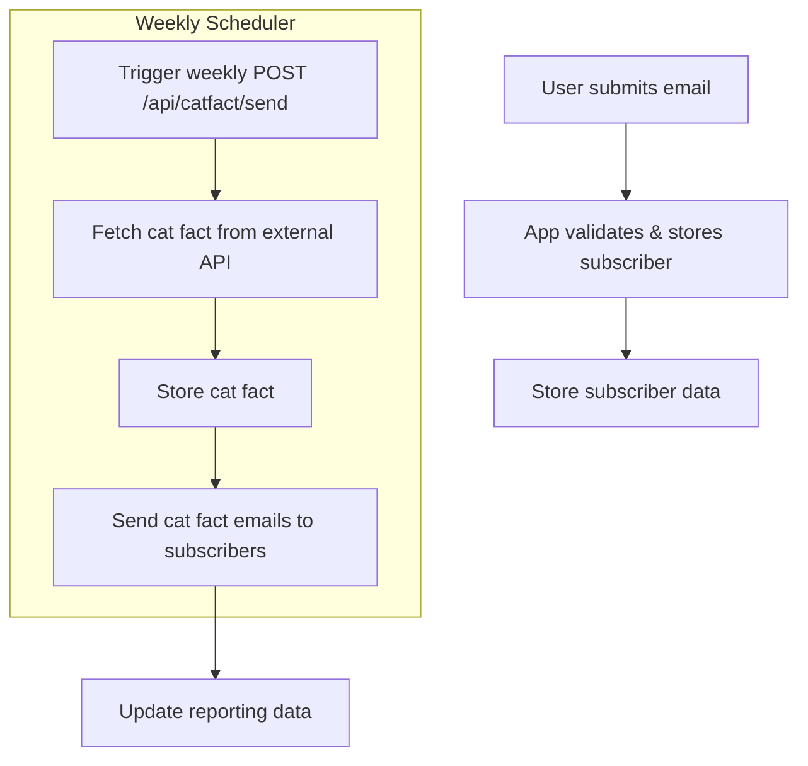

```markdown
# Weekly Cat Fact Subscription - Functional Requirements

## API Endpoints

### 1. User Subscription

- **POST** `/api/subscribers`
  - Description: Register a new subscriber.
  - Request Body (application/json):
    ```json
    {
      "email": "user@example.com"
    }
    ```
  - Response:
    - 201 Created
    - 400 Bad Request (if email invalid or already subscribed)
  - Business logic: Validate and store subscriber email.

- **GET** `/api/subscribers`
  - Description: Retrieve list of all subscribers.
  - Response Body (application/json):
    ```json
    {
      "subscribers": [
        { "email": "user1@example.com" },
        { "email": "user2@example.com" }
      ],
      "count": 2
    }
    ```

---

### 2. Cat Fact Ingestion and Email Publishing

- **POST** `/api/catfact/send`
  - Description: Trigger ingestion of a new cat fact from external API and send emails to all subscribers.
  - Request Body: Empty or optional control parameters.
  - Response:
    - 200 OK with summary
    ```json
    {
      "catFact": "Cats have five toes on their front paws, but only four toes on their back paws.",
      "emailsSent": 42
    }
    ```
  - Business logic:
    - Fetch cat fact from https://catfact.ninja/fact (external API)
    - Store fact for reporting
    - Send email with fact to all subscribers

- **GET** `/api/catfact/latest`
  - Description: Retrieve the latest cat fact sent.
  - Response Body:
    ```json
    {
      "catFact": "Cats have five toes on their front paws, but only four toes on their back paws.",
      "sentAt": "2024-06-15T12:00:00Z"
    }
    ```

---

### 3. Reporting

- **GET** `/api/report`
  - Description: Get reporting data about subscribers and interactions.
  - Response Body:
    ```json
    {
      "subscriberCount": 42,
      "factsSent": 10,
      "lastSentAt": "2024-06-15T12:00:00Z"
    }
    ```

---

## User-App Interaction Sequence Diagram



---

## Subscriber Sign-up and Weekly Fact Delivery Flow


```