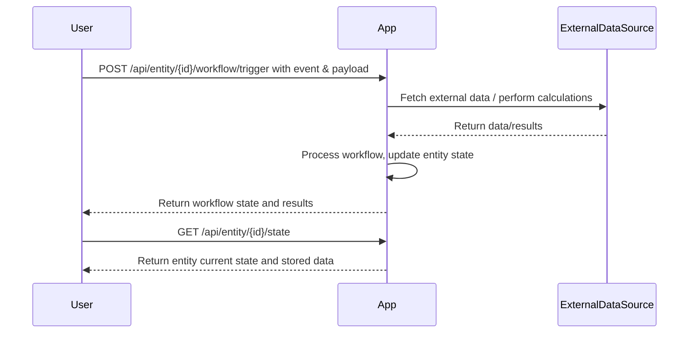
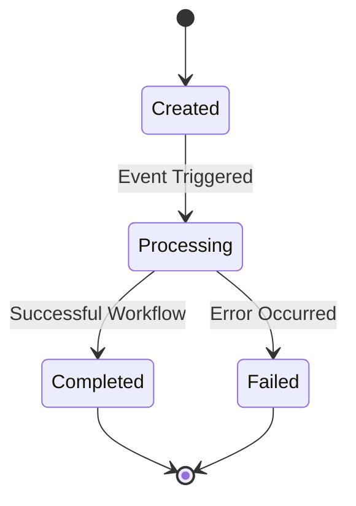

```markdown
# Functional Requirements and API Design

## Core Concepts
- Entity-centric application with workflows triggered by events.
- External data retrieval or calculations occur via POST endpoints.
- GET endpoints are used solely for retrieving stored application results.
- JSON is used for requests and responses.

---

## API Endpoints

### 1. Trigger Workflow on Entity (POST)
/api/entity/{entity_id}/workflow/trigger

- **Description:** Trigger a workflow event on an entity with optional input data.
- **Request:**
```json
{
  "event": "string",            // Name of the event triggering the workflow
  "payload": {                  // Optional data for processing or calculations
    "key": "value"
  }
}
```
- **Response:**
```json
{
  "status": "success",
  "workflow_state": "string",   // Updated workflow state after processing
  "result": {                   // Optional results from processing or calculations
    "key": "value"
  }
}
```

---

### 2. Retrieve Entity State and Results (GET)
/api/entity/{entity_id}/state

- **Description:** Retrieve the current state and stored results of an entity.
- **Response:**
```json
{
  "entity_id": "string",
  "current_state": "string",
  "data": {
    "key": "value"              // Stored data/results for the entity
  }
}
```

---

### 3. List Entities (GET)
/api/entity/list

- **Description:** Retrieve a list of entities, optionally filtered by state.
- **Query Parameters (optional):**
  - `state`: filter entities by workflow state
  - `limit`, `offset`: for pagination
- **Response:**
```json
{
  "entities": [
    {
      "entity_id": "string",
      "current_state": "string"
    }
  ]
}
```

---

## Business Logic Notes

- External data fetching and calculations must be performed inside POST endpoints as part of the workflow trigger.
- GET endpoints are strictly read-only for retrieving stored data.
- Workflow engine manages state transitions and invokes appropriate processors.

---

## User-App Interaction Sequence



---

## Entity Lifecycle Diagram


```