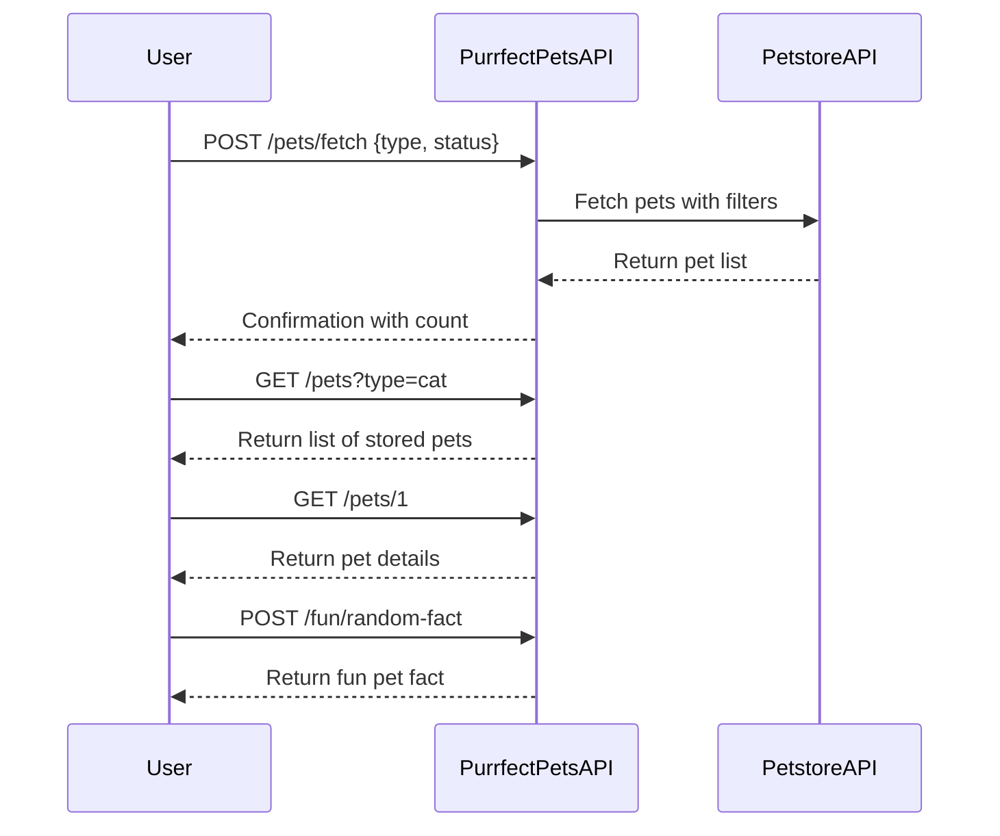
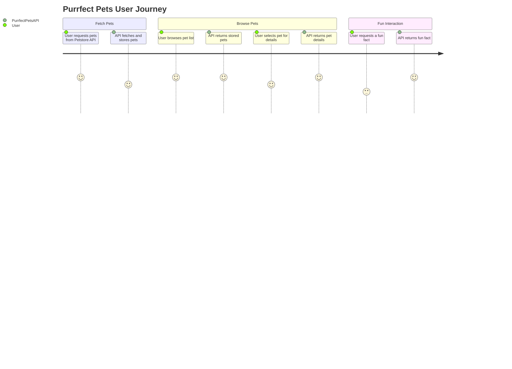

```markdown
# Purrfect Pets API - Functional Requirements

## Overview
The "Purrfect Pets" API app uses Petstore API data as an external data source. All external data retrieval or business logic that involves interaction with the Petstore API happens in POST endpoints. GET endpoints serve only to retrieve results or processed data stored internally or cached.

---

## API Endpoints

### 1. **POST /pets/fetch**
- **Purpose:** Fetch pets from Petstore API based on filters and store/cache results internally.
- **Request JSON:**
  ```json
  {
    "type": "string",          // optional, e.g. "dog", "cat"
    "status": "string"         // optional, e.g. "available", "sold", "pending"
  }
  ```
- **Response JSON:**
  ```json
  {
    "message": "Pets fetched and stored",
    "count": 10
  }
  ```

---

### 2. **GET /pets**
- **Purpose:** Retrieve list of cached/stored pets.
- **Query Parameters (optional):**
  - `type`: string (filter by pet type)
  - `status`: string (filter by pet status)
- **Response JSON:**
  ```json
  [
    {
      "id": 1,
      "name": "Fluffy",
      "type": "cat",
      "status": "available"
    },
    ...
  ]
  ```

---

### 3. **GET /pets/{petId}**
- **Purpose:** Retrieve detailed info about a specific pet from stored data.
- **Response JSON:**
  ```json
  {
    "id": 1,
    "name": "Fluffy",
    "type": "cat",
    "status": "available",
    "photoUrls": ["url1", "url2"],
    "tags": ["cute", "small"]
  }
  ```

---

### 4. **POST /fun/random-fact**
- **Purpose:** Return a random fun pet fact or joke (can be static or fetched from external source).
- **Request JSON:** *Empty or optional category field*
  ```json
  {}
  ```
- **Response JSON:**
  ```json
  {
    "fact": "Cats sleep for 70% of their lives!"
  }
  ```

---

## Business Logic Notes
- `POST /pets/fetch` triggers external Petstore API calls and updates internal cache/store.
- `GET` endpoints only expose data already fetched and stored.
- `POST /fun/random-fact` can use static or dynamic sources for fun facts.

---

## User-App Interaction Sequence Diagram



---

## User Journey Diagram


```