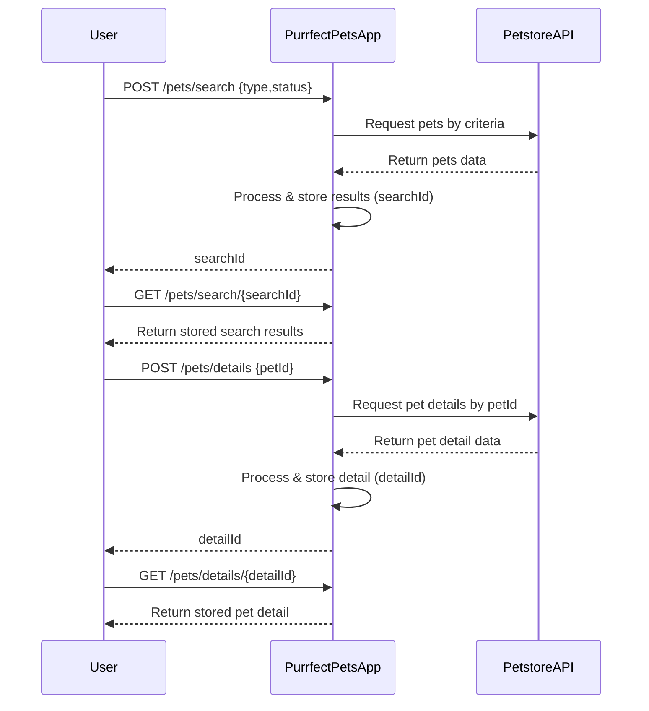

```markdown
# Purrfect Pets API - Functional Requirements

## Overview
The "Purrfect Pets" API app uses Petstore API data to provide pet-related functionalities.  
Following RESTful principles with the rule:  
- **POST** endpoints perform business logic including external data fetching or calculations.  
- **GET** endpoints retrieve stored or computed results from our app only.

---

## API Endpoints

### 1. POST /pets/search  
- **Purpose:** Search pets by criteria (e.g., type, status) by invoking Petstore API, process results, and store them locally for retrieval.  
- **Request:**  
```json
{
  "type": "string",        // optional, e.g. "dog", "cat"
  "status": "string"       // optional, e.g. "available", "sold"
}
```  
- **Response:**  
```json
{
  "searchId": "string"     // unique ID to retrieve results via GET
}
```

---

### 2. GET /pets/search/{searchId}  
- **Purpose:** Retrieve stored search results for a previous search.  
- **Response:**  
```json
{
  "searchId": "string",
  "results": [
    {
      "id": 123,
      "name": "Fluffy",
      "type": "dog",
      "status": "available"
    },
    ...
  ]
}
```

---

### 3. POST /pets/details  
- **Purpose:** Fetch detailed pet info by pet ID from Petstore API, process and store it.  
- **Request:**  
```json
{
  "petId": 123
}
```  
- **Response:**  
```json
{
  "detailId": "string"     // unique ID to retrieve pet detail
}
```

---

### 4. GET /pets/details/{detailId}  
- **Purpose:** Retrieve stored detailed pet info.  
- **Response:**  
```json
{
  "detailId": "string",
  "id": 123,
  "name": "Fluffy",
  "type": "dog",
  "status": "available",
  "description": "Friendly dog who loves to play."
}
```

---

## Business Logic Notes

- POST endpoints trigger external Petstore API calls, process raw data, and store results with unique IDs.  
- GET endpoints serve stored results by IDs without external calls.  
- Search results and details are cached/stored temporarily for retrieval.  
- App maintains mapping of `searchId` and `detailId` to results.

---

## User-App Interaction Sequence



---

## Summary

| Endpoint          | Method | Purpose                               | Request Body                  | Response Body                 |
|-------------------|--------|-------------------------------------|------------------------------|------------------------------|
| /pets/search      | POST   | Search pets (external call & store) | `{type, status}`              | `{searchId}`                  |
| /pets/search/{id} | GET    | Get stored search results            | N/A                          | `{searchId, results[]}`       |
| /pets/details     | POST   | Get pet details by ID (external call & store) | `{petId}`                    | `{detailId}`                  |
| /pets/details/{id}| GET    | Get stored pet detail                | N/A                          | `{detailId, pet info}`        |
```
