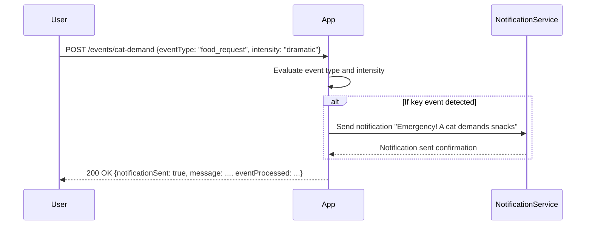

```markdown
# Functional Requirements and API Design for Cat Event Detection App

## API Endpoint

### POST /events/cat-demand
- **Purpose:** Receive and process cat events (e.g., dramatic food requests) and instantly notify humans if needed.
- **Request Body (JSON):**
  ```json
  {
    "catId": "string",            // Optional: ID if multiple cats supported
    "eventType": "string",        // e.g., "food_request"
    "intensity": "string"         // e.g., "dramatic", "normal"
  }
  ```
- **Response (JSON):**
  ```json
  {
    "notificationSent": true,
    "message": "Emergency! A cat demands snacks",
    "eventProcessed": {
      "catId": "string",
      "eventType": "string",
      "intensity": "string",
      "timestamp": "ISO8601 datetime"
    }
  }
  ```
- **Business Logic:**  
  - Evaluate the incoming event.  
  - If the event is a key cat event (e.g., dramatic food request), trigger an immediate notification with message:  
    `"Emergency! A cat demands snacks"`.  
  - Return the notification status and event details in the response.

---

## User-App Interaction Sequence Diagram



---

## Summary

- Single POST endpoint to submit cat events.
- Endpoint evaluates events and triggers notification on key events.
- Response includes notification status and event details.
- Clear JSON request and response formats following RESTful design.

---

If you have no further questions or adjustments, I can mark this discussion as finished and proceed with the implementation.
```