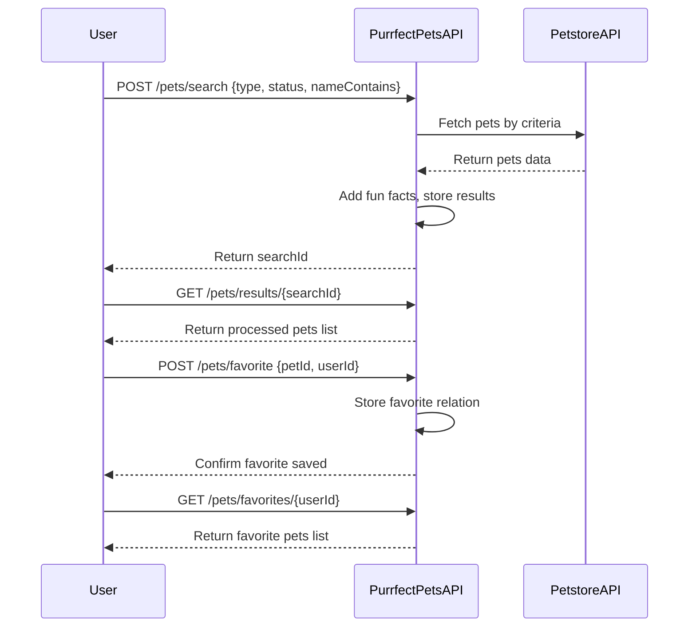

```markdown
# Purrfect Pets API - Functional Requirements

## Overview  
The app will interact with the external Petstore API primarily via POST endpoints to fetch and process data. GET endpoints will be used only to retrieve processed or cached results from our app.

---

## API Endpoints

### 1. **POST /pets/search**  
**Purpose:** Search for pets by criteria, fetch data from Petstore API, apply any business logic (e.g., filter, enrich with fun facts), and store results for retrieval.  
**Request Body:**  
```json
{
  "type": "string",         // e.g., "cat", "dog", optional
  "status": "string",       // e.g., "available", optional
  "nameContains": "string"  // optional substring filter on pet name
}
```  
**Response:**  
```json
{
  "searchId": "string"      // unique ID to retrieve results later
}
```

---

### 2. **GET /pets/results/{searchId}**  
**Purpose:** Retrieve processed search results by `searchId`.  
**Response:**  
```json
{
  "searchId": "string",
  "pets": [
    {
      "id": "number",
      "name": "string",
      "type": "string",
      "status": "string",
      "funFact": "string"   // added fun fact about the pet type
    },
    ...
  ]
}
```

---

### 3. **POST /pets/favorite**  
**Purpose:** Mark a pet as favorite (stored in app state).  
**Request Body:**  
```json
{
  "petId": "number",
  "userId": "string"
}
```
**Response:**  
```json
{
  "success": true
}
```

---

### 4. **GET /pets/favorites/{userId}**  
**Purpose:** Retrieve favorite pets for a user.  
**Response:**  
```json
{
  "userId": "string",
  "favorites": [
    {
      "id": "number",
      "name": "string",
      "type": "string",
      "status": "string"
    },
    ...
  ]
}
```

---

## Business Logic Summary  
- All external Petstore API data retrieval and processing happen in POST endpoints.  
- GET endpoints serve only data stored in the app (search results, favorites).  
- Fun facts are added based on pet type (e.g., cats are curious, dogs are loyal).  
- Favorite pets are user-specific and stored internally.

---

## User-App Interaction Sequence


```