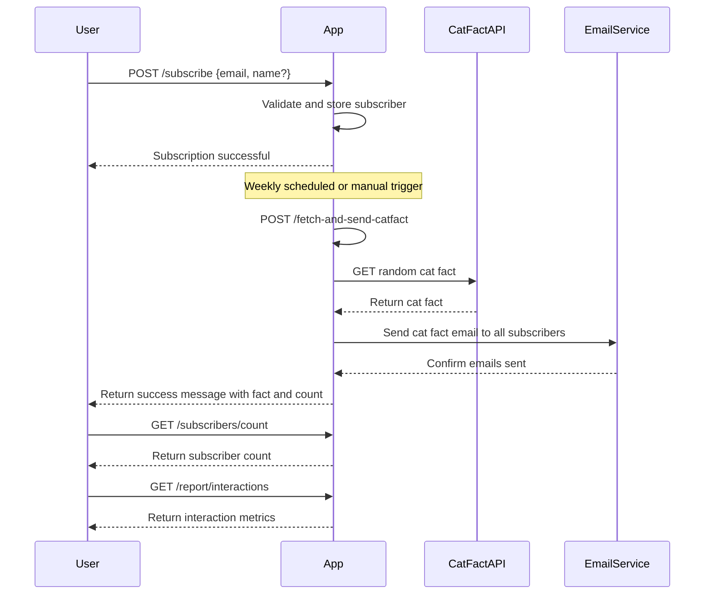

```markdown
# Weekly Cat Fact Subscription - Functional Requirements

## API Endpoints

### 1. User Subscription

- **POST /subscribe**

  Register a new subscriber with their email (and optionally name).

  **Request Body (JSON):**
  ```json
  {
    "email": "user@example.com",
    "name": "Optional User Name"
  }
  ```

  **Response (JSON):**
  ```json
  {
    "message": "Subscription successful",
    "subscriberId": "uuid-string"
  }
  ```

- **GET /subscribers/count**

  Retrieve the current number of subscribers.

  **Response (JSON):**
  ```json
  {
    "subscriberCount": 123
  }
  ```

### 2. Weekly Cat Fact Ingestion and Publishing

- **POST /fetch-and-send-catfact**

  Trigger fetching a new cat fact from the external Cat Fact API and send it via email to all subscribers.

  **Request Body:** None

  **Response (JSON):**
  ```json
  {
    "message": "Cat fact fetched and emails sent",
    "fact": "Cats have five toes on their front paws, but only four toes on their back paws.",
    "emailsSent": 123
  }
  ```

### 3. Reporting

- **GET /report/interactions**

  Retrieve aggregated interaction metrics (e.g., emails opened, clicks).

  **Response (JSON):**
  ```json
  {
    "emailsSent": 123,
    "emailsOpened": 100,
    "clicks": 25
  }
  ```

---

## User-App Interaction Sequence Diagram



---

## Summary

- POST endpoints handle external API calls and business logic.
- GET endpoints return app state and reports only.
- User subscribes via POST /subscribe.
- Weekly cat fact fetching and email sending via POST /fetch-and-send-catfact.
- Reporting via GET endpoints.
```
