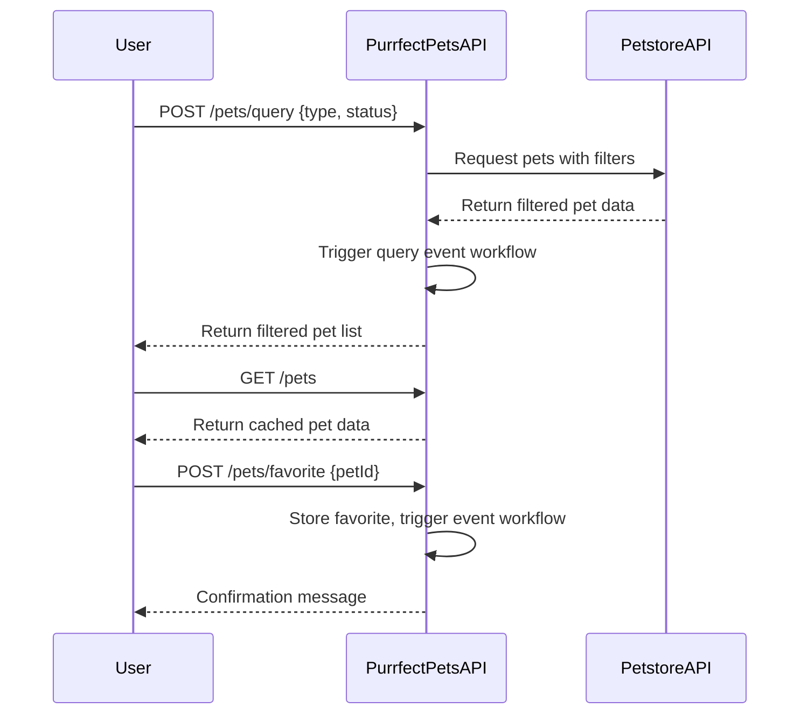

```markdown
# Purrfect Pets API - Functional Requirements

## API Endpoints

### 1. **POST /pets/query**
- **Purpose:** Retrieve and filter pets data from the external Petstore API.
- **Request Body:**
  ```json
  {
    "type": "string",      // Optional: pet type filter (e.g., "cat", "dog")
    "status": "string"     // Optional: pet status filter (e.g., "available", "sold")
  }
  ```
- **Response:**
  ```json
  {
    "pets": [
      {
        "id": "integer",
        "name": "string",
        "type": "string",
        "status": "string",
        "photoUrls": ["string"]
      }
    ]
  }
  ```
- **Business Logic:**  
  - Accepts filters, calls external Petstore API to fetch pet data.
  - Applies any additional filtering or transformation.
  - Triggers event workflow logging the query.

---

### 2. **GET /pets**
- **Purpose:** Retrieve the last queried or cached pets data from the application.
- **Response:**
  ```json
  {
    "pets": [
      {
        "id": "integer",
        "name": "string",
        "type": "string",
        "status": "string",
        "photoUrls": ["string"]
      }
    ]
  }
  ```

---

### 3. **POST /pets/favorite**
- **Purpose:** Mark a pet as favorite by pet ID.
- **Request Body:**
  ```json
  {
    "petId": "integer"
  }
  ```
- **Response:**
  ```json
  {
    "message": "Pet marked as favorite",
    "petId": "integer"
  }
  ```
- **Business Logic:**  
  - Stores favorite state internally.
  - Triggers event workflow on favorite action.

---

## User-App Interaction Sequence Diagram


```