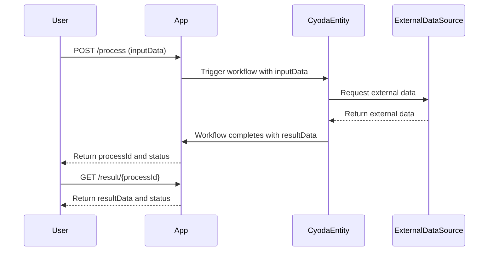
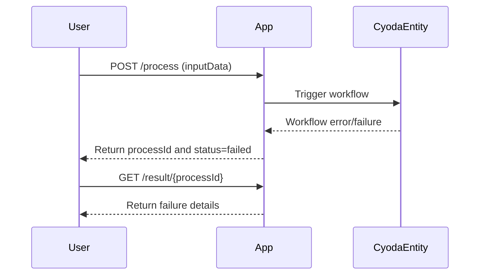

```markdown
# Functional Requirements for Cyoda Python Quart Application

## API Endpoints

### 1. POST `/process`
**Purpose:**  
- Accept input data  
- Perform business logic including external data retrieval or calculations  
- Trigger Cyoda entity workflows  
- Store processing results  

**Request Format (JSON):**  
```json
{
  "inputData": { /* arbitrary input structure */ }
}
```

**Response Format (JSON):**  
```json
{
  "processId": "string",        // Unique identifier for the processing instance
  "status": "processing|completed|failed"
}
```

---

### 2. GET `/result/<processId>`
**Purpose:**  
- Retrieve results of a previously processed request by `processId`  
- Read-only endpoint returning application results only  

**Response Format (JSON):**  
```json
{
  "processId": "string",
  "resultData": { /* output data structure */ },
  "status": "completed|failed"
}
```

---

## Business Logic Notes

- All external data retrieval and calculations are executed within the POST `/process` endpoint.  
- The GET `/result/<processId>` endpoint only returns stored results, no external calls.  
- POST `/process` triggers Cyoda entity workflows driven by the input event.  
- The entity’s state machine manages workflow execution and result generation.

---

## User-App Interaction Sequence Diagram



---

## Alternative User Journey (Error Handling)


```
