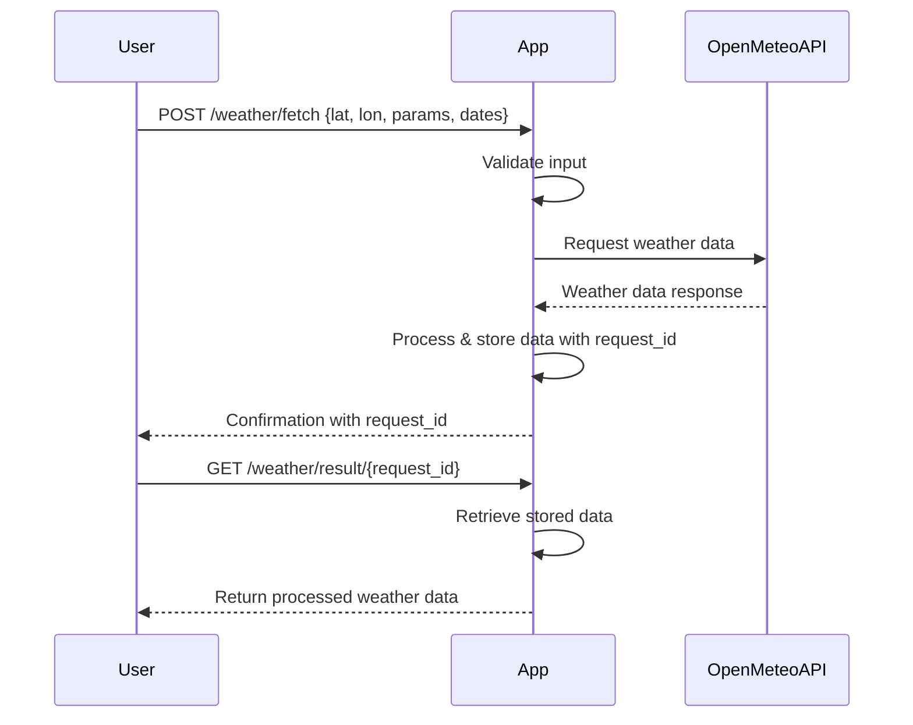

```markdown
# Functional Requirements for Weather Data Fetching App

## API Endpoints

### 1. POST `/weather/fetch`
- **Purpose:** Trigger fetching weather data from Open-Meteo API based on input parameters and store/process results.
- **Request Body (JSON):**
  ```json
  {
    "latitude": 52.52,
    "longitude": 13.41,
    "parameters": ["temperature_2m", "precipitation"],
    "start_date": "2024-06-01",
    "end_date": "2024-06-02"
  }
  ```
- **Response (JSON):**
  ```json
  {
    "status": "success",
    "message": "Weather data fetch initiated",
    "request_id": "abc123"
  }
  ```
- **Business Logic:**
  - Validate input coordinates and parameters.
  - Call Open-Meteo API with given parameters and date range.
  - Process and store the fetched data linked to `request_id`.

---

### 2. GET `/weather/result/{request_id}`
- **Purpose:** Retrieve stored weather data results for a given fetch request.
- **Response (JSON):**
  ```json
  {
    "request_id": "abc123",
    "latitude": 52.52,
    "longitude": 13.41,
    "data": {
      "temperature_2m": [21.3, 20.8, ...],
      "precipitation": [0.0, 0.1, ...]
    },
    "date_range": {
      "start": "2024-06-01",
      "end": "2024-06-02"
    }
  }
  ```

---

## User-App Interaction Sequence Diagram



---

## Summary

- POST endpoint triggers fetching and processing weather data.
- GET endpoint retrieves stored results.
- Requests and responses use JSON.
- Business logic (API call, validation, processing) only in POST.
- GET only returns stored data.
```
