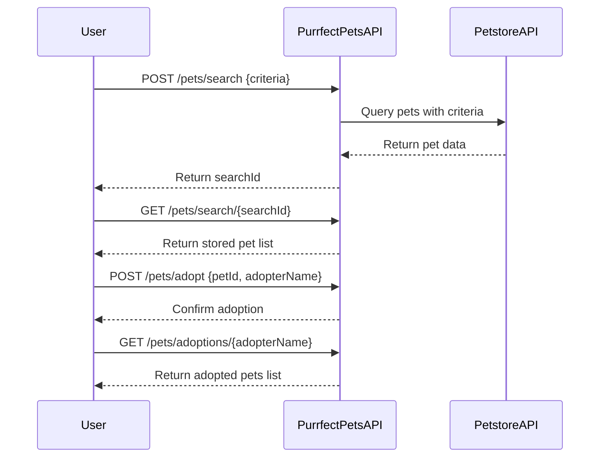

```markdown
# Purrfect Pets API - Functional Requirements

## Overview
The "Purrfect Pets" API app interacts with the Petstore API data to provide pet-related information. It follows RESTful principles with the key constraint that any business logic involving external data retrieval or calculations happens in POST endpoints, while GET endpoints serve only to retrieve already processed application data.

---

## API Endpoints

### 1. POST /pets/search  
**Purpose:** Search pets from external Petstore API based on criteria and store results internally.  
**Request Body:**  
```json
{
  "type": "string",        // optional: cat, dog, etc.
  "status": "string",      // optional: available, sold, pending
  "tags": ["string"]       // optional: list of tags to filter
}
```  
**Response:**  
```json
{
  "searchId": "string"     // unique ID for this search session
}
```

---

### 2. GET /pets/search/{searchId}  
**Purpose:** Retrieve search results stored from previous POST request.  
**Response:**  
```json
{
  "searchId": "string",
  "pets": [
    {
      "id": "integer",
      "name": "string",
      "type": "string",
      "status": "string",
      "tags": ["string"]
    }
  ]
}
```

---

### 3. POST /pets/adopt  
**Purpose:** Simulate adoption of a pet by marking it adopted internally (no external call).  
**Request Body:**  
```json
{
  "petId": "integer",
  "adopterName": "string"
}
```  
**Response:**  
```json
{
  "petId": "integer",
  "adopterName": "string",
  "adoptionStatus": "confirmed"
}
```

---

### 4. GET /pets/adoptions/{adopterName}  
**Purpose:** Retrieve list of pets adopted by a particular adopter.  
**Response:**  
```json
{
  "adopterName": "string",
  "adoptedPets": [
    {
      "id": "integer",
      "name": "string",
      "type": "string",
      "status": "string"
    }
  ]
}
```

---

## Notes on Business Logic

- All calls to the external Petstore API happen only in POST /pets/search.
- POST /pets/adopt updates internal state only.
- GET endpoints return data stored or processed by previous POST requests.
- Internal storage of search results and adoption data is assumed.

---

## User-App Interaction Sequence Diagram



---

## User Journey Diagram

```mermaid
flowchart TD
    A[User initiates pet search] --> B{POST /pets/search}
    B --> C[Pets retrieved from Petstore API]
    C --> D[Search results stored internally]
    D --> E[User views search results via GET /pets/search/{searchId}]
    E --> F[User decides to adopt a pet]
    F --> G{POST /pets/adopt}
    G --> H[Adoption confirmed and stored]
    H --> I[User retrieves adopted pets via GET /pets/adoptions/{adopterName}]
```
```