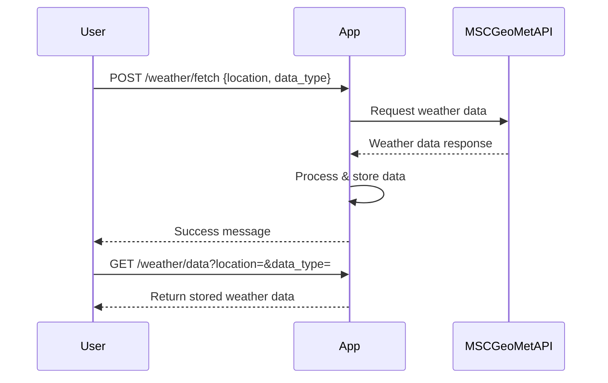

```markdown
# Functional Requirements for Weather Data App

## API Endpoints

### 1. POST /weather/fetch
- **Purpose:** Trigger fetching weather data from MSC GeoMet public API.
- **Request Body:**  
```json
{
  "location": "string",       // e.g., city name or coordinates
  "data_type": "string"       // e.g., "current", "forecast", "historical"
}
```
- **Response:**  
```json
{
  "status": "success",
  "message": "Weather data fetched and stored successfully"
}
```
- **Notes:**  
  This endpoint invokes the external MSC GeoMet API, fetches the requested weather data, processes it if needed, and stores it in the app.

---

### 2. GET /weather/data
- **Purpose:** Retrieve stored weather data for a specified location and type.
- **Query Parameters:**  
  - `location` (string)  
  - `data_type` (string)  
- **Response:**  
```json
{
  "location": "string",
  "data_type": "string",
  "data": { /* weather data object */ }
}
```
- **Notes:**  
  Returns the latest stored weather data for the given parameters.

---

## Sequence Diagram of User-App Interaction


```