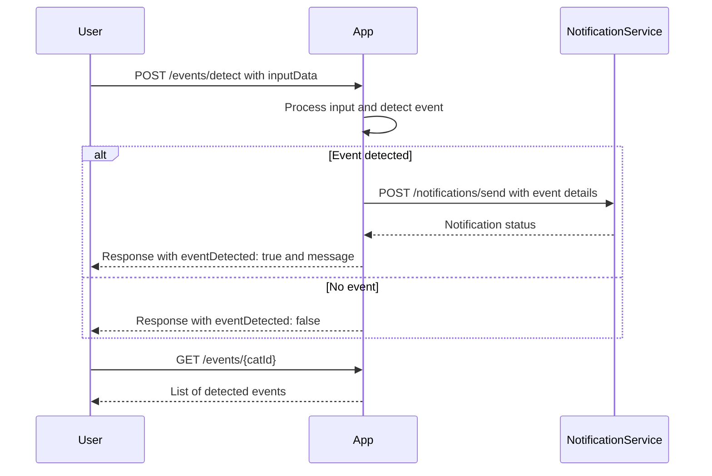

```markdown
# Functional Requirements for Cat Event Detection App

## API Endpoints

### 1. POST /events/detect
- **Description:** Receive input data (e.g., audio or text) for detecting key cat events like dramatic food requests. This endpoint processes the input, runs detection logic, and triggers notifications if needed.
- **Request Body:**  
  ```json
  {
    "catId": "string",
    "inputType": "audio" | "text",
    "inputData": "string"  // Base64 encoded audio or raw text describing cat behavior
  }
  ```
- **Response:**  
  ```json
  {
    "eventDetected": true | false,
    "eventType": "food_request" | "other",
    "message": "string"
  }
  ```

### 2. GET /events/{catId}
- **Description:** Retrieve detected events for a specific cat.
- **Response:**  
  ```json
  [
    {
      "eventId": "string",
      "timestamp": "ISO8601 datetime string",
      "eventType": "food_request" | "other",
      "message": "string"
    }
  ]
  ```

### 3. POST /notifications/send
- **Description:** Internal endpoint triggered by event detection to send notification to humans.
- **Request Body:**  
  ```json
  {
    "catId": "string",
    "eventType": "food_request" | "other",
    "message": "string"
  }
  ```
- **Response:**  
  ```json
  {
    "status": "success" | "failure",
    "details": "string"
  }
  ```

---

## User-App Interaction Sequence


```