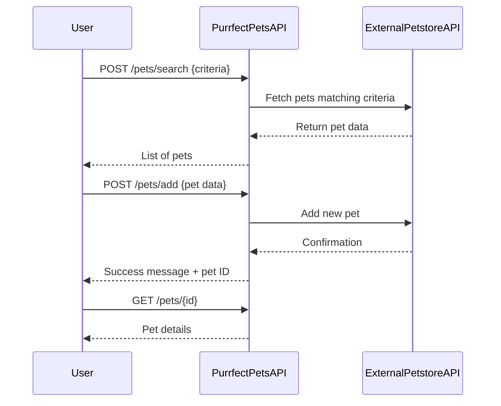

```markdown
# Purrfect Pets API - Functional Requirements

## API Endpoints Overview

### 1. **POST /pets/search**
- **Description:** Search for pets using criteria (e.g., type, status, name).
- **Request Body:**
  ```json
  {
    "type": "string (optional)",
    "status": "string (optional)",
    "name": "string (optional)"
  }
  ```
- **Response:** List of pets matching criteria.
  ```json
  {
    "pets": [
      {
        "id": "integer",
        "name": "string",
        "type": "string",
        "status": "string",
        "photoUrls": ["string"]
      }
    ]
  }
  ```

### 2. **POST /pets/add**
- **Description:** Add a new pet to the store.
- **Request Body:**
  ```json
  {
    "name": "string",
    "type": "string",
    "status": "string",
    "photoUrls": ["string (optional)"]
  }
  ```
- **Response:**
  ```json
  {
    "id": "integer",
    "message": "Pet added successfully"
  }
  ```

### 3. **POST /pets/update**
- **Description:** Update an existing pet's info.
- **Request Body:**
  ```json
  {
    "id": "integer",
    "name": "string (optional)",
    "type": "string (optional)",
    "status": "string (optional)",
    "photoUrls": ["string (optional)"]
  }
  ```
- **Response:**
  ```json
  {
    "message": "Pet updated successfully"
  }
  ```

### 4. **POST /pets/delete**
- **Description:** Delete a pet by ID.
- **Request Body:**
  ```json
  {
    "id": "integer"
  }
  ```
- **Response:**
  ```json
  {
    "message": "Pet deleted successfully"
  }
  ```

### 5. **GET /pets/{id}**
- **Description:** Retrieve pet details by ID.
- **Response:**
  ```json
  {
    "id": "integer",
    "name": "string",
    "type": "string",
    "status": "string",
    "photoUrls": ["string"]
  }
  ```

---

## Business Logic Notes
- All external data retrieval or updates to Petstore API are done inside POST endpoints.
- GET endpoints only retrieve data stored or cached within the application.
- Validation and error handling to be included for all endpoints.

---

## User-App Interaction Sequence Diagram



---

## User Journey Diagram

```mermaid
flowchart TD
  A[Start: User wants pet info] --> B{Choose action}
  B --> |Search pets| C[POST /pets/search]
  B --> |Add pet| D[POST /pets/add]
  B --> |Update pet| E[POST /pets/update]
  B --> |Delete pet| F[POST /pets/delete]
  B --> |View pet details| G[GET /pets/{id}]

  C --> H[Receive pet list]
  D --> I[Receive add confirmation]
  E --> J[Receive update confirmation]
  F --> K[Receive delete confirmation]
  G --> L[Receive pet details]

  H --> M[End]
  I --> M
  J --> M
  K --> M
  L --> M
```
```