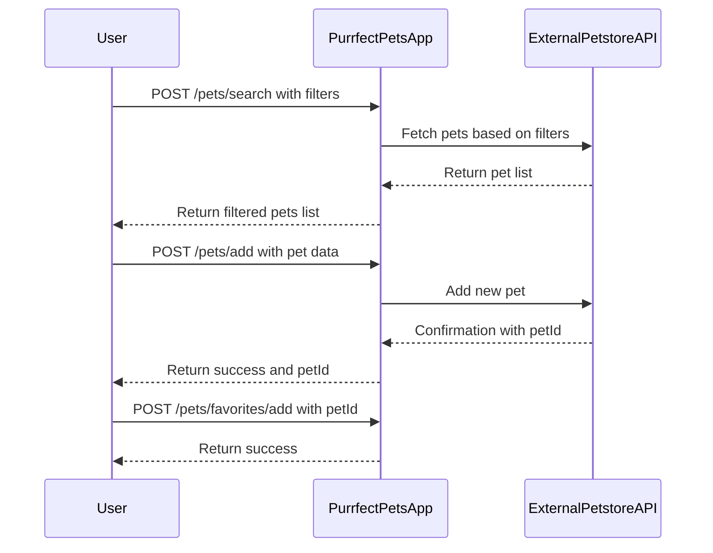
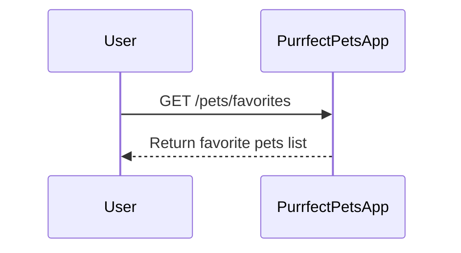

```markdown
# Purrfect Pets API - Functional Requirements

## API Endpoints

### 1. POST /pets/search  
**Description:** Search and retrieve pets from the external Petstore API based on filters (e.g., status, type).  
**Request:**  
```json
{
  "status": "available",   // optional, e.g., "available", "sold", "pending"
  "type": "cat"            // optional, e.g., "cat", "dog"
}
```  
**Response:**  
```json
{
  "pets": [
    {
      "id": 123,
      "name": "Fluffy",
      "type": "cat",
      "status": "available",
      "photoUrls": ["url1", "url2"]
    }
  ]
}
```

---

### 2. POST /pets/add  
**Description:** Add a new pet via external Petstore API.  
**Request:**  
```json
{
  "name": "Whiskers",
  "type": "cat",
  "status": "available",
  "photoUrls": ["url1"]
}
```  
**Response:**  
```json
{
  "success": true,
  "petId": 124
}
```

---

### 3. POST /pets/update  
**Description:** Update pet information via external Petstore API.  
**Request:**  
```json
{
  "id": 124,
  "name": "Whiskers",
  "status": "sold"
}
```  
**Response:**  
```json
{
  "success": true
}
```

---

### 4. POST /pets/delete  
**Description:** Delete a pet by id via external Petstore API.  
**Request:**  
```json
{
  "id": 124
}
```  
**Response:**  
```json
{
  "success": true
}
```

---

### 5. GET /pets/favorites  
**Description:** Retrieve the list of favorite pets saved locally in the app.  
**Response:**  
```json
{
  "favorites": [
    {
      "id": 123,
      "name": "Fluffy",
      "type": "cat",
      "status": "available"
    }
  ]
}
```

---

### 6. POST /pets/favorites/add  
**Description:** Add a pet to favorites (local app storage).  
**Request:**  
```json
{
  "id": 123
}
```  
**Response:**  
```json
{
  "success": true
}
```

---

### 7. POST /pets/favorites/remove  
**Description:** Remove a pet from favorites (local app storage).  
**Request:**  
```json
{
  "id": 123
}
```  
**Response:**  
```json
{
  "success": true
}
```

---

## User-App Interaction Sequence Diagram



---

## User Favorites Retrieval Flow


```