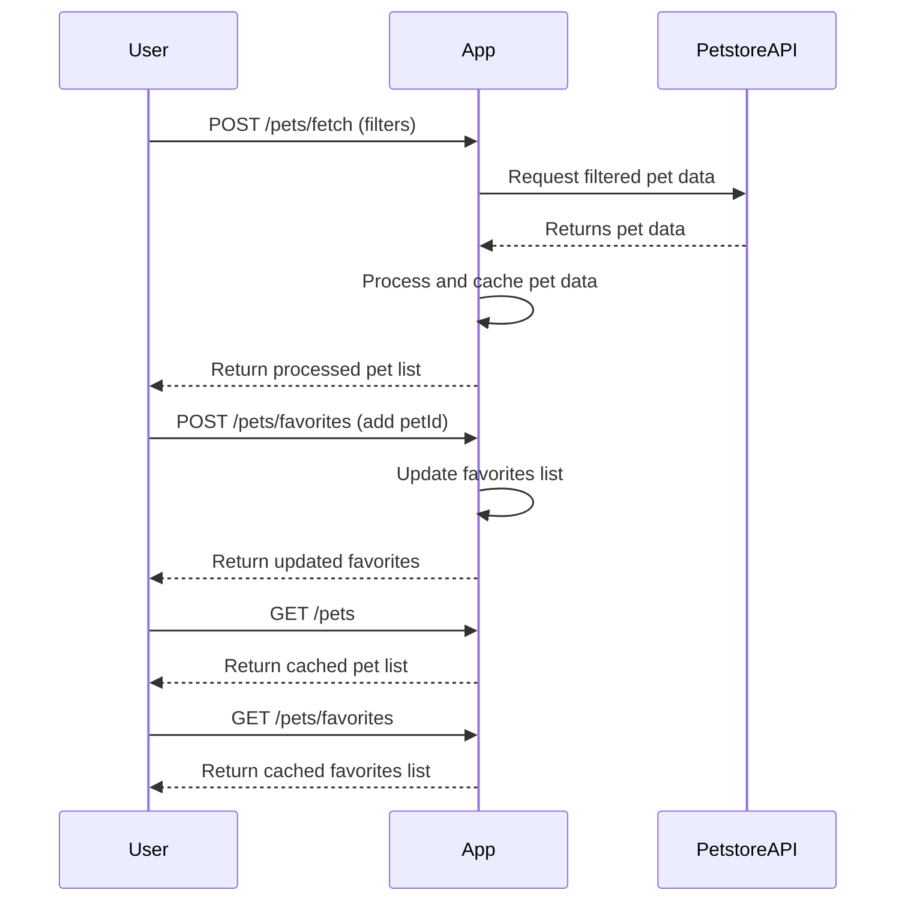
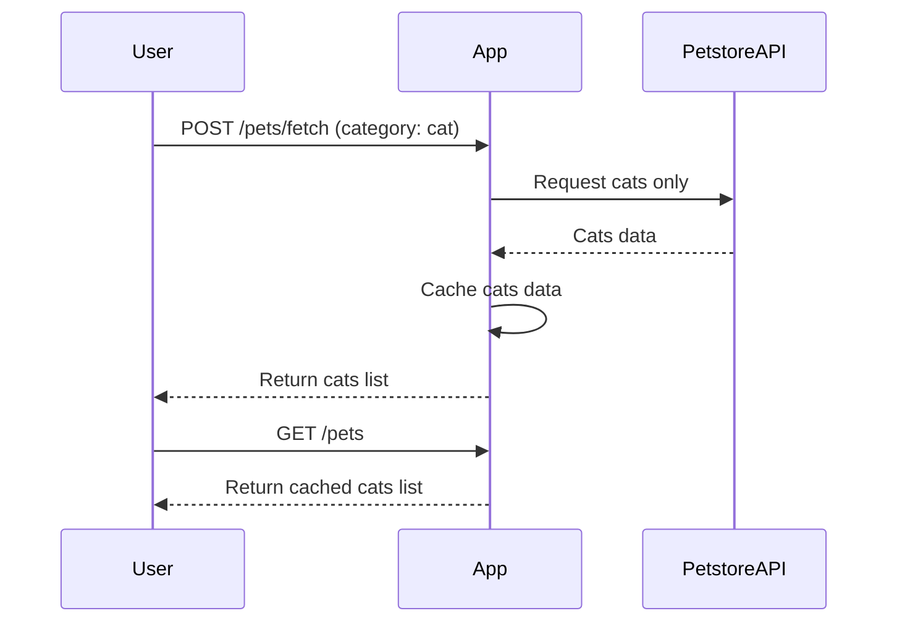

```markdown
# Functional Requirements for "Purrfect Pets" API App

## Overview
The app fetches and processes pet data from the Petstore API via POST endpoints, then provides processed or cached results through GET endpoints. The app supports filtering and favorites management.

---

## API Endpoints

### 1. `POST /pets/fetch`
- **Purpose:** Fetch and process pet data from the external Petstore API based on filters.
- **Request Body:**
```json
{
  "categories": ["cat", "dog"],      // Optional, list of pet categories to filter
  "status": "available",             // Optional, filter by pet status
  "limit": 20                       // Optional, number of pets to fetch
}
```
- **Response Body:**
```json
{
  "pets": [
    {
      "id": 1,
      "name": "Whiskers",
      "category": "cat",
      "status": "available",
      "photoUrls": ["url1", "url2"],
      "description": "Playful cat"
    },
    ...
  ]
}
```

---

### 2. `POST /pets/favorites`
- **Purpose:** Add or remove pets from user's favorites.
- **Request Body:**
```json
{
  "action": "add",           // "add" or "remove"
  "petId": 1
}
```
- **Response Body:**
```json
{
  "success": true,
  "favorites": [1, 3, 5]    // Current list of favorite pet IDs
}
```

---

### 3. `GET /pets`
- **Purpose:** Retrieve the last fetched list of pets (processed data).
- **Response Body:**
```json
{
  "pets": [
    {
      "id": 1,
      "name": "Whiskers",
      "category": "cat",
      "status": "available",
      "photoUrls": ["url1", "url2"],
      "description": "Playful cat"
    },
    ...
  ]
}
```

---

### 4. `GET /pets/favorites`
- **Purpose:** Retrieve the current list of favorite pets.
- **Response Body:**
```json
{
  "favorites": [
    {
      "id": 1,
      "name": "Whiskers",
      "category": "cat",
      "status": "available",
      "photoUrls": ["url1", "url2"],
      "description": "Playful cat"
    },
    ...
  ]
}
```

---

## Business Logic Notes
- External Petstore API calls happen only in `POST /pets/fetch`.
- Favorites management happens via `POST /pets/favorites`.
- GET endpoints serve cached or processed data only.
- Data validation and error handling are included but not detailed here.

---

## User-App Interaction Sequence



---

## Alternative User Journey (Viewing and Filtering)



---
```