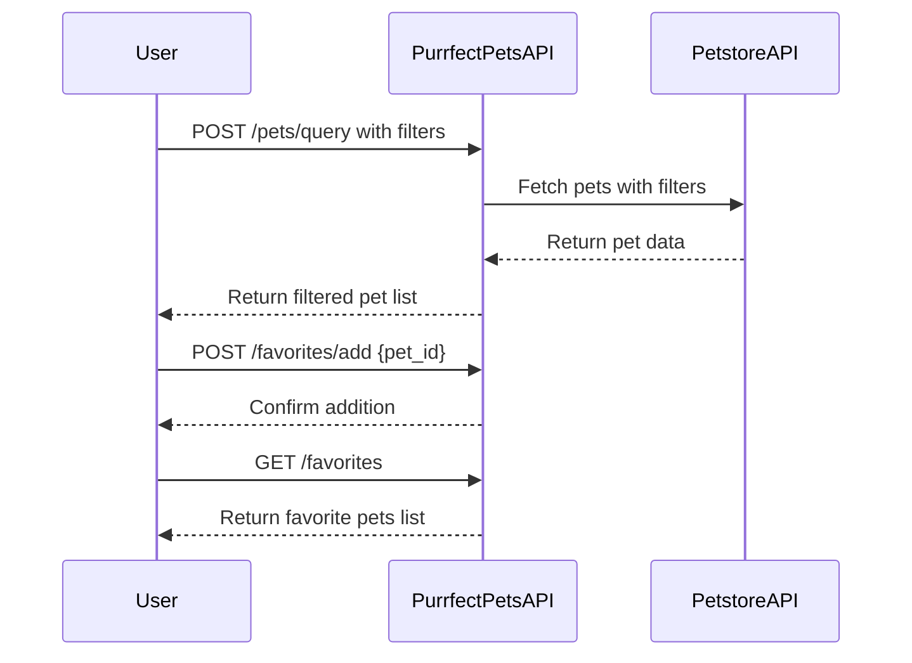

```markdown
# Purrfect Pets API - Functional Requirements

## Overview
The "Purrfect Pets" API app provides a fun and interactive way to explore Petstore API data, focusing on filtering, sorting, and managing favorite pets.

---

## API Endpoints

### 1. POST /pets/query  
**Description:** Query pets from Petstore API with filters and sorting.  
**Request:**  
```json
{
  "filters": {
    "category": "string",      // e.g. "cat", "dog"
    "status": "string"         // e.g. "available", "sold"
  },
  "sort_by": "string",          // e.g. "name", "price"
  "sort_order": "asc" | "desc",
  "limit": 10,
  "offset": 0
}
```  
**Response:**  
```json
{
  "pets": [
    {
      "id": 123,
      "name": "Fluffy",
      "category": "cat",
      "status": "available",
      "photoUrls": ["url1", "url2"],
      "tags": ["cute", "playful"]
    }
  ],
  "total_count": 50
}
```

---

### 2. POST /favorites/add  
**Description:** Add a pet to user’s favorites list.  
**Request:**  
```json
{
  "pet_id": 123
}
```  
**Response:**  
```json
{
  "success": true,
  "message": "Pet added to favorites."
}
```

---

### 3. POST /favorites/remove  
**Description:** Remove a pet from user’s favorites list.  
**Request:**  
```json
{
  "pet_id": 123
}
```  
**Response:**  
```json
{
  "success": true,
  "message": "Pet removed from favorites."
}
```

---

### 4. GET /favorites  
**Description:** Retrieve user’s favorite pets stored locally.  
**Response:**  
```json
{
  "favorites": [
    {
      "id": 123,
      "name": "Fluffy",
      "category": "cat",
      "status": "available",
      "photoUrls": ["url1", "url2"]
    }
  ]
}
```

---

## User-App Interaction Sequence



---

## Notes  
- POST endpoints handle all business logic and external API calls.  
- GET endpoints only retrieve local app data (e.g., favorites).  
- Favorites are managed locally within the app, not on Petstore API.

```
If you want me to proceed with implementation, just say the word!