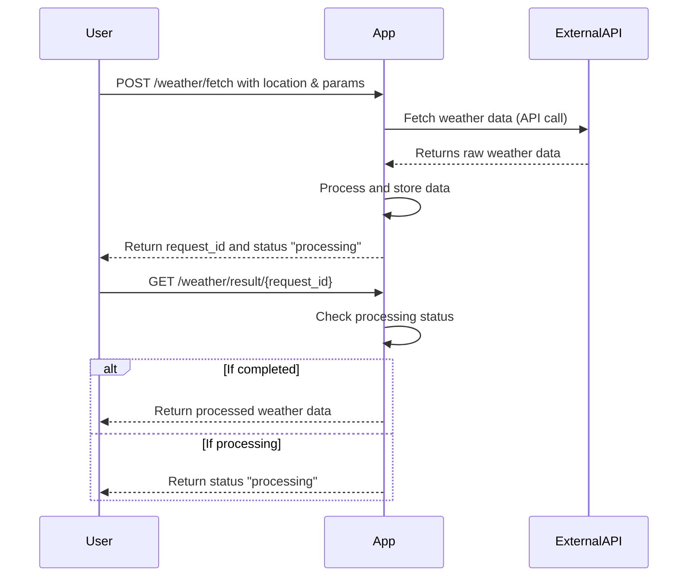

```markdown
# Functional Requirements for Weather Data Fetching App

## API Endpoints

### 1. POST /weather/fetch
- **Purpose:** Trigger fetching weather data from the external API based on user input (location, parameters).
- **Request Body (JSON):**
  ```json
  {
    "latitude": 52.52,
    "longitude": 13.405,
    "parameters": ["temperature_2m", "precipitation"],
    "start_date": "2024-06-01",
    "end_date": "2024-06-02"
  }
  ```
- **Response (JSON):**
  ```json
  {
    "request_id": "uuid-string",
    "status": "processing"
  }
  ```
- **Description:** Accepts location and weather parameters, invokes external API, processes data asynchronously, and stores results linked to `request_id`.

---

### 2. GET /weather/result/{request_id}
- **Purpose:** Retrieve processed weather data results for a given request.
- **Response (JSON):**
  ```json
  {
    "request_id": "uuid-string",
    "status": "completed",
    "data": {
      "temperature_2m": [20.5, 21.0, 19.8],
      "precipitation": [0.0, 0.2, 0.0],
      "dates": ["2024-06-01T00:00", "2024-06-01T06:00", "2024-06-01T12:00"]
    }
  }
  ```
- **Description:** Returns stored results after processing is complete. If still processing, returns status accordingly.

---

## User-App Interaction Sequence Diagram


```