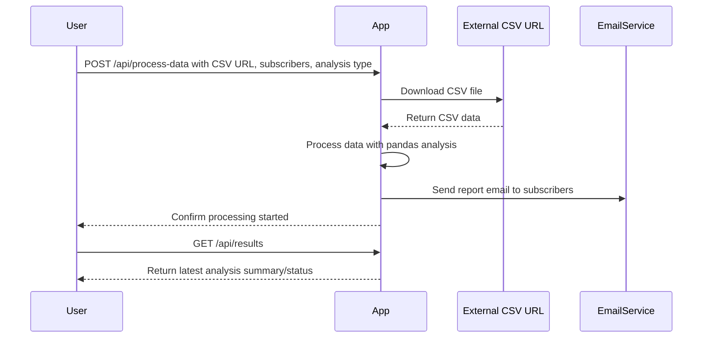

```markdown
# Functional Requirements and API Design

## Overview
The application downloads CSV data, analyzes it using pandas, and sends a report via email. It exposes RESTful API endpoints to trigger data processing and retrieve results.

---

## API Endpoints

### 1. Trigger Data Processing  
**POST** `/api/process-data`  
- **Description:** Downloads the CSV from the given URL, runs analysis, and sends the report email to subscribers.  
- **Request Body (JSON):**
  ```json
  {
    "csv_url": "string",
    "subscribers": ["email1@example.com", "email2@example.com"],
    "analysis_type": "string"  // e.g., "summary", "filtering"
  }
  ```
- **Response (JSON):**
  ```json
  {
    "status": "processing_started",
    "message": "Data processing and email sending initiated."
  }
  ```

---

### 2. Retrieve Processing Results  
**GET** `/api/results`  
- **Description:** Retrieve the latest analysis report summary or status.  
- **Response (JSON):**
  ```json
  {
    "status": "completed",
    "summary": {
      "rows_processed": 123,
      "columns": ["col1", "col2", "..."],
      "statistics": {...}
    },
    "last_processed_at": "2024-06-01T12:00:00Z"
  }
  ```

---

## Business Logic Notes
- The POST `/api/process-data` endpoint handles all external data fetching, pandas analysis, and triggering the email.
- The GET `/api/results` endpoint returns cached or last known results without triggering new processing.

---

## User-App Interaction Sequence


```