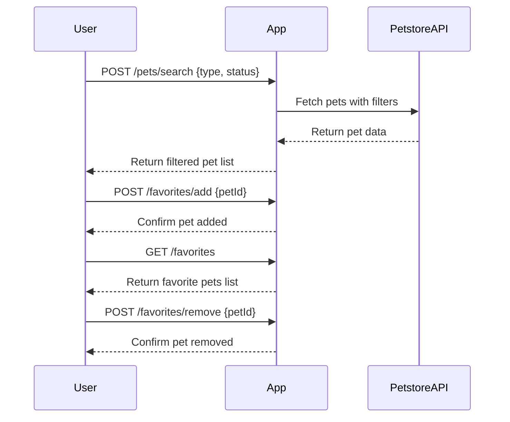

```markdown
# Purrfect Pets API - Functional Requirements

## Overview
The API provides functionalities to interact with pet data based on Petstore API. It supports retrieving pet lists, filtering, and managing a favorites list. Business logic that fetches or processes external data is handled via POST endpoints; GET endpoints are used only to retrieve stored or computed results.

---

## API Endpoints

### 1. Fetch and Filter Pets  
**POST** `/pets/search`  
- **Description:** Retrieve pet data from Petstore API, optionally filtered by type or status.  
- **Request Body (JSON):**  
```json
{
  "type": "string (optional, e.g., dog, cat)",
  "status": "string (optional, e.g., available, sold)"
}
```  
- **Response (JSON):**  
```json
{
  "pets": [
    {
      "id": "integer",
      "name": "string",
      "type": "string",
      "status": "string",
      "photoUrls": ["string"]
    }
  ]
}
```

---

### 2. Add Pet to Favorites  
**POST** `/favorites/add`  
- **Description:** Add a specific pet to the user's favorites list.  
- **Request Body (JSON):**  
```json
{
  "petId": "integer"
}
```  
- **Response (JSON):**  
```json
{
  "message": "Pet added to favorites",
  "favoriteCount": "integer"
}
```

---

### 3. Remove Pet from Favorites  
**POST** `/favorites/remove`  
- **Description:** Remove a pet from the user's favorites list.  
- **Request Body (JSON):**  
```json
{
  "petId": "integer"
}
```  
- **Response (JSON):**  
```json
{
  "message": "Pet removed from favorites",
  "favoriteCount": "integer"
}
```

---

### 4. Get Favorite Pets  
**GET** `/favorites`  
- **Description:** Retrieve the list of pets currently marked as favorites by the user.  
- **Response (JSON):**  
```json
{
  "favorites": [
    {
      "id": "integer",
      "name": "string",
      "type": "string",
      "status": "string",
      "photoUrls": ["string"]
    }
  ]
}
```

---

## User-App Interaction Sequence Diagram



---

## Summary

- POST endpoints handle external data fetching and business logic.  
- GET endpoint returns stored user-specific data (favorites).  
- Request and response formats are JSON.  
- User can search/filter pets, and manage a favorites list.
```
