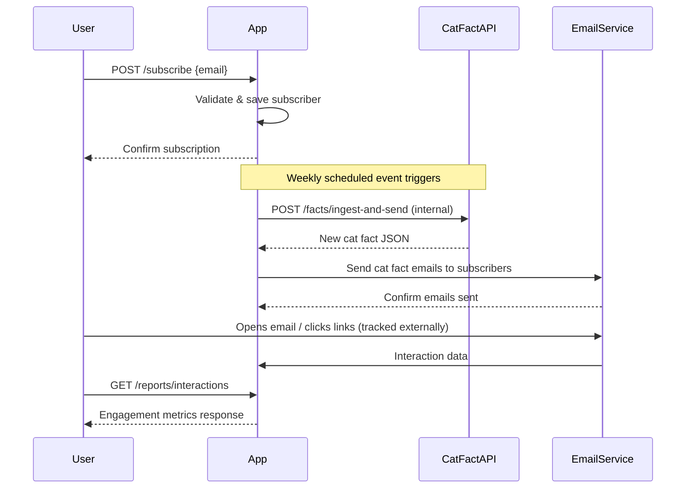

```markdown
# Functional Requirements for Weekly Cat Fact Subscription App

## API Endpoints

### 1. User Subscription

- **POST /subscribe**  
  Registers a new subscriber.  
  **Request:**  
  ```json
  {
    "email": "user@example.com"
  }
  ```  
  **Response:**  
  ```json
  {
    "message": "Subscription successful",
    "subscriberId": "uuid"
  }
  ```

- **GET /subscribers/count**  
  Retrieves the total number of subscribers.  
  **Response:**  
  ```json
  {
    "count": 123
  }
  ```

### 2. Weekly Cat Fact Ingestion & Sending

- **POST /facts/ingest-and-send**  
  Triggers ingestion of a new cat fact from Cat Fact API, sends it to all subscribers via email, and records interactions.  
  **Request:**  
  ```json
  {}
  ```  
  **Response:**  
  ```json
  {
    "factId": "uuid",
    "factText": "Cats have five toes on their front paws.",
    "emailsSent": 100
  }
  ```

### 3. Reporting

- **GET /reports/interactions**  
  Retrieves engagement metrics (e.g., emails sent, clicks, opens) for cat fact campaigns.  
  **Response:**  
  ```json
  {
    "totalEmailsSent": 500,
    "totalClicks": 120,
    "totalOpens": 300
  }
  ```

---

## User-App Interaction Sequence



---

## Summary

- POST endpoints handle external data retrieval and business logic (subscription, ingestion, sending).
- GET endpoints provide data retrieval for app state and reporting.
- Interaction flows from user subscription to weekly fact ingestion, email delivery, and reporting.
```