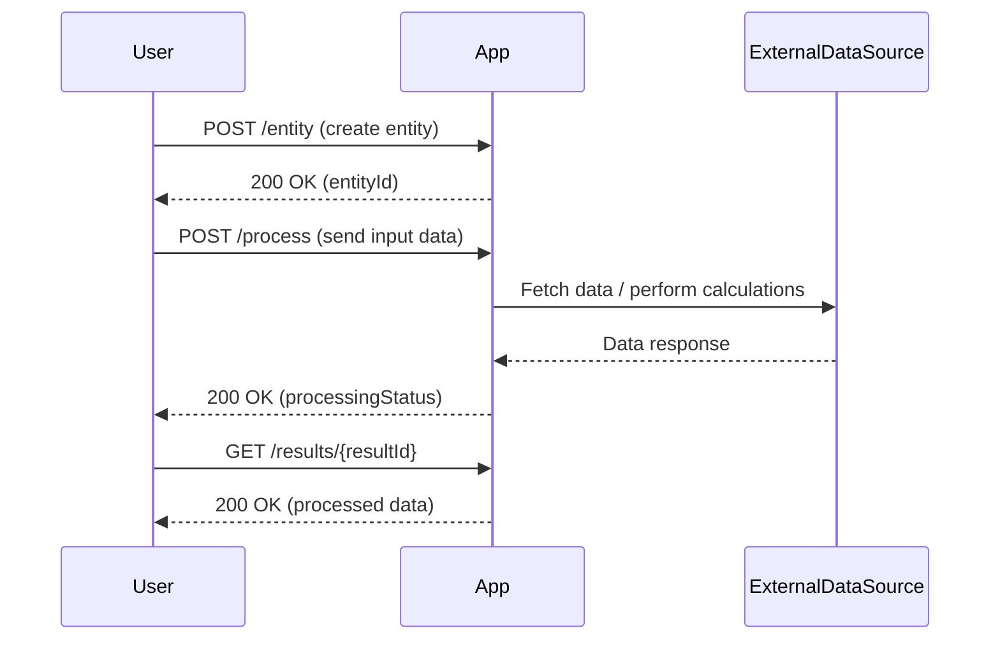

```markdown
# Functional Requirements and API Design

## Overview
The application exposes RESTful API endpoints adhering to these rules:
- **POST** endpoints perform business logic, including external data retrieval, calculations, and processing.
- **GET** endpoints are used solely to retrieve results stored or computed within the application.

---

## API Endpoints

### 1. Create Entity / Trigger Workflow  
**POST** `/entity`  
- Description: Create a new entity and trigger its workflow based on input data.  
- Request:  
```json
{
  "entityType": "string",
  "attributes": { "key": "value", ... }
}
```  
- Response:  
```json
{
  "entityId": "string",
  "status": "workflow triggered"
}
```

---

### 2. Process Data / Invoke External Source  
**POST** `/process`  
- Description: Perform business logic that may include calling external data sources, performing calculations, or transforming data.  
- Request:  
```json
{
  "entityId": "string",
  "inputData": { "key": "value", ... }
}
```  
- Response:  
```json
{
  "resultId": "string",
  "processingStatus": "completed"
}
```

---

### 3. Retrieve Processed Results  
**GET** `/results/{resultId}`  
- Description: Retrieve the results of previous processing or workflow execution.  
- Response:  
```json
{
  "resultId": "string",
  "data": { "key": "value", ... }
}
```

---

## User-App Interaction Sequence


```

If you have no further questions or adjustments, I can proceed with the implementation.  
Would you like me to continue?