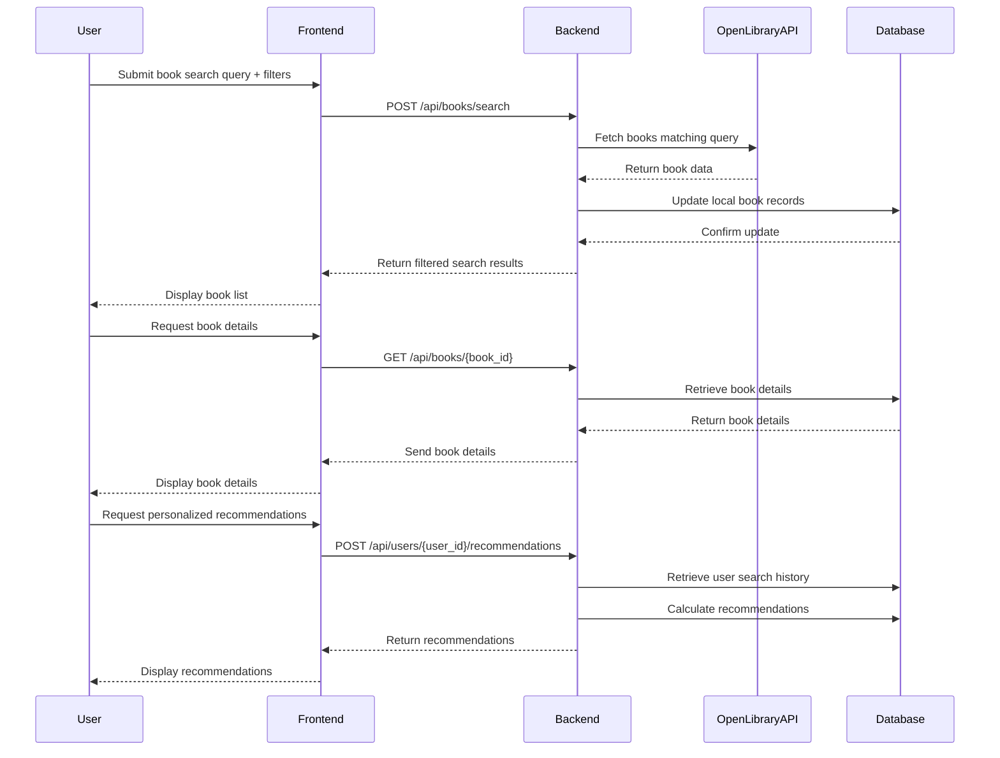
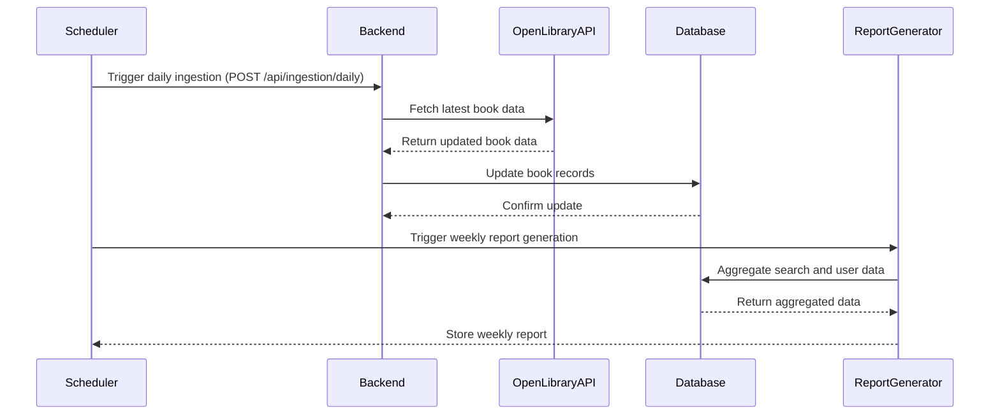

```markdown
# Functional Requirements and API Design for Book Search and Recommendation Application

## API Endpoints

### 1. Search Books (POST)
- **URL:** `/api/books/search`
- **Description:** Accepts user query and filters, fetches search results from Open Library API, stores or updates local database, then returns filtered results.
- **Request Body (JSON):**
```json
{
  "query": "string",
  "filters": {
    "genre": "string (optional)",
    "author": "string (optional)",
    "publication_year": "integer (optional)"
  },
  "page": "integer (optional, default=1)",
  "page_size": "integer (optional, default=20)"
}
```
- **Response (JSON):**
```json
{
  "results": [
    {
      "book_id": "string",
      "title": "string",
      "author": "string",
      "genre": "string",
      "publication_year": "integer",
      "cover_image": "url"
    }
  ],
  "total_results": "integer",
  "page": "integer",
  "page_size": "integer"
}
```

---

### 2. Retrieve Book Details (GET)
- **URL:** `/api/books/{book_id}`
- **Description:** Retrieves detailed stored information about a single book.
- **Response (JSON):**
```json
{
  "book_id": "string",
  "title": "string",
  "author": "string",
  "genre": "string",
  "publication_year": "integer",
  "cover_image": "url",
  "description": "string (optional)"
}
```

---

### 3. User Search History (GET)
- **URL:** `/api/users/{user_id}/search-history`
- **Description:** Retrieves previous search queries and filters for the user.
- **Response (JSON):**
```json
{
  "user_id": "string",
  "search_history": [
    {
      "query": "string",
      "filters": {
        "genre": "string",
        "author": "string",
        "publication_year": "integer"
      },
      "timestamp": "ISO8601 string"
    }
  ]
}
```

---

### 4. Generate Recommendations (POST)
- **URL:** `/api/users/{user_id}/recommendations`
- **Description:** Based on previous searches, returns personalized book recommendations.
- **Request Body (JSON):**
```json
{
  "limit": "integer (optional, default=10)"
}
```
- **Response (JSON):**
```json
{
  "user_id": "string",
  "recommendations": [
    {
      "book_id": "string",
      "title": "string",
      "author": "string",
      "cover_image": "url"
    }
  ]
}
```

---

### 5. Weekly Report Generation (GET)
- **URL:** `/api/reports/weekly`
- **Description:** Retrieves generated weekly reports on most searched books and user preferences.
- **Response (JSON):**
```json
{
  "report_date": "ISO8601 string",
  "most_searched_books": [
    {
      "book_id": "string",
      "title": "string",
      "search_count": "integer"
    }
  ],
  "user_preferences_summary": {
    "top_genres": ["string"],
    "top_authors": ["string"]
  }
}
```

---

### 6. Trigger Daily Data Ingestion (POST)
- **URL:** `/api/ingestion/daily`
- **Description:** Triggers the daily ingest process to update local book database from Open Library API.
- **Request Body:** *Empty*
- **Response:**
```json
{
  "status": "string",
  "message": "string"
}
```

---

## User-App Interaction Sequence



---

## Daily Ingestion and Weekly Reporting Flow


```