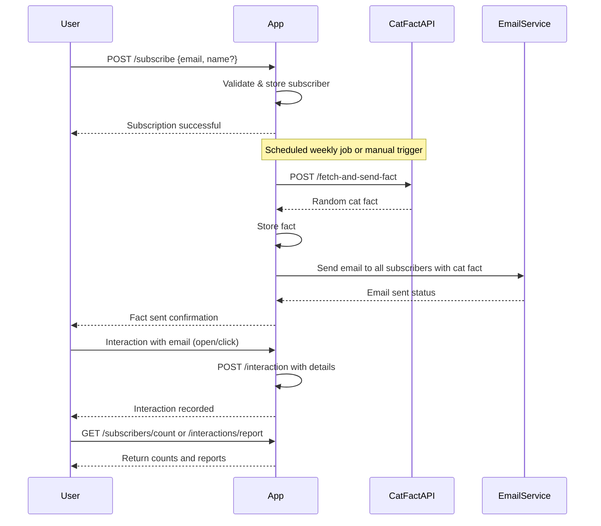

```markdown
# Functional Requirements for Weekly Cat Fact Subscription Application

## API Endpoints

### 1. User Subscription

- **POST /subscribe**
  - Description: Add a new subscriber.
  - Request Body (JSON):
    ```json
    {
      "email": "user@example.com",
      "name": "Optional User Name"
    }
    ```
  - Response (JSON):
    ```json
    {
      "message": "Subscription successful",
      "subscriberId": "uuid"
    }
    ```

- **GET /subscribers/count**
  - Description: Retrieve the total number of subscribers.
  - Response (JSON):
    ```json
    {
      "count": 123
    }
    ```

### 2. Cat Fact Ingestion & Email Sending

- **POST /fetch-and-send-fact**
  - Description: Trigger data ingestion from Cat Fact API, store the fact, and send it via email to all subscribers.
  - Request Body: *Empty or optional control parameters (e.g., force send)*
  - Response (JSON):
    ```json
    {
      "message": "Cat fact sent to X subscribers",
      "fact": "Cats have five toes on their front paws, but only four toes on their back paws."
    }
    ```

### 3. Interaction Tracking

- **POST /interaction**
  - Description: Record subscriber interaction with the cat fact email (e.g., open, click).
  - Request Body (JSON):
    ```json
    {
      "subscriberId": "uuid",
      "interactionType": "open" | "click",
      "factId": "uuid"
    }
    ```
  - Response (JSON):
    ```json
    {
      "message": "Interaction recorded"
    }
    ```

- **GET /interactions/report**
  - Description: Retrieve summary of interactions (e.g., total opens, clicks).
  - Response (JSON):
    ```json
    {
      "totalOpens": 100,
      "totalClicks": 30
    }
    ```

---

## User-App Interaction Sequence Diagram



---

## Summary

- POST endpoints handle all external data retrieval and side effects.
- GET endpoints return stored data and reports.
- A weekly scheduled job or manual trigger invokes `/fetch-and-send-fact`.
- Users subscribe via `/subscribe` and interactions are tracked via `/interaction`.
```