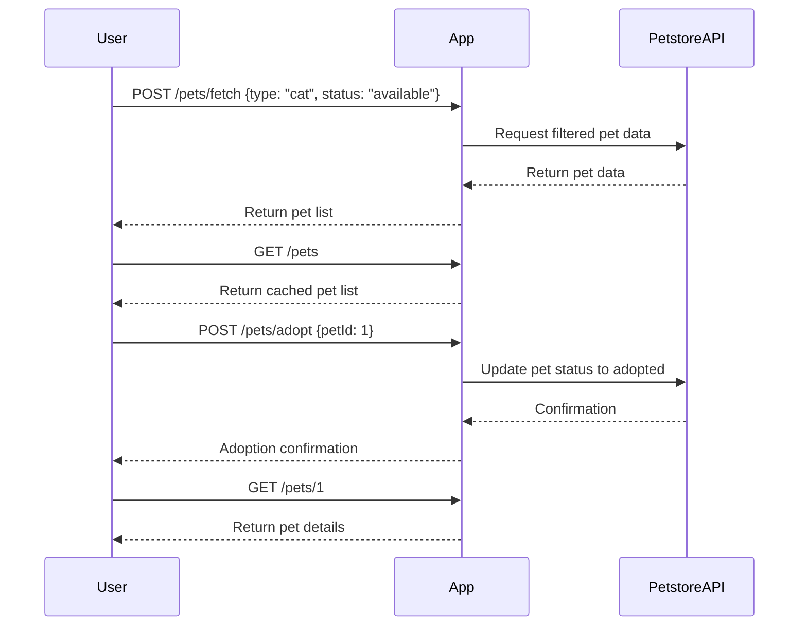

```markdown
# Purrfect Pets API - Functional Requirements

## API Endpoints

### 1. POST /pets/fetch  
**Description:** Fetch pet data from external Petstore API (e.g., filter by type, status).  
**Request:**  
```json
{
  "type": "cat",           // optional, e.g., "cat", "dog"
  "status": "available"    // optional, e.g., "available", "sold"
}
```  
**Response:**  
```json
{
  "pets": [
    {
      "id": 1,
      "name": "Whiskers",
      "type": "cat",
      "status": "available",
      "tags": ["cute", "playful"]
    },
    ...
  ]
}
```

---

### 2. POST /pets/adopt  
**Description:** Mark a pet as adopted (updates external or internal state).  
**Request:**  
```json
{
  "petId": 1
}
```  
**Response:**  
```json
{
  "message": "Pet with ID 1 has been adopted."
}
```

---

### 3. GET /pets  
**Description:** Retrieve locally stored or cached list of pets previously fetched or modified.  
**Response:**  
```json
{
  "pets": [
    {
      "id": 1,
      "name": "Whiskers",
      "type": "cat",
      "status": "adopted",
      "tags": ["cute", "playful"]
    },
    ...
  ]
}
```

---

### 4. GET /pets/{id}  
**Description:** Retrieve details of a specific pet by ID from local store.  
**Response:**  
```json
{
  "id": 1,
  "name": "Whiskers",
  "type": "cat",
  "status": "adopted",
  "tags": ["cute", "playful"]
}
```

---

## Business Logic Notes  
- All external Petstore API calls happen only in POST endpoints (`/pets/fetch`, `/pets/adopt`).  
- GET endpoints serve cached or local data only.  
- Adoption updates should sync/update local and external states if applicable.

---

## User-App Interaction Sequence


```