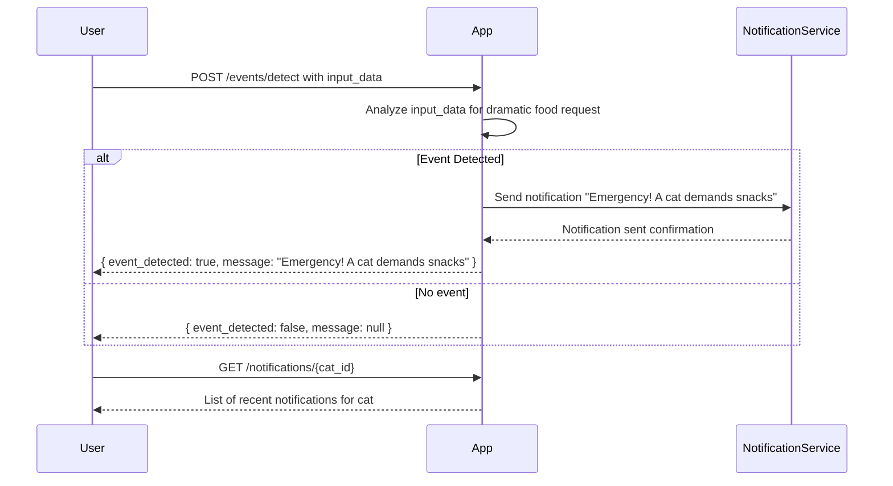

```markdown
# Functional Requirements for Cat Event Detection App

## API Endpoints

### 1. POST /events/detect
- **Purpose:** Receive raw input (e.g., text/audio metadata) to detect key cat events such as dramatic food requests.
- **Request:**
  ```json
  {
    "cat_id": "string",
    "input_type": "text" | "audio" | "sensor",
    "input_data": "string or base64 encoded audio or sensor data"
  }
  ```
- **Response:**
  ```json
  {
    "event_detected": true | false,
    "event_type": "food_request" | null,
    "message": "Emergency! A cat demands snacks" | null
  }
  ```
- **Business logic:**  
  Analyze `input_data` to detect if it corresponds to a dramatic food request event. If yes, trigger notification workflow.

---

### 2. GET /notifications/{cat_id}
- **Purpose:** Retrieve recent notifications sent for the given cat.
- **Response:**
  ```json
  {
    "cat_id": "string",
    "notifications": [
      {
        "timestamp": "ISO8601 string",
        "message": "string"
      }
    ]
  }
  ```

---

### 3. POST /notifications/send
- **Purpose:** (Optional) Manually send notification for a detected event.
- **Request:**
  ```json
  {
    "cat_id": "string",
    "message": "string"
  }
  ```
- **Response:**
  ```json
  {
    "status": "success" | "failure",
    "details": "string"
  }
  ```

---

## User-App Interaction Sequence


```