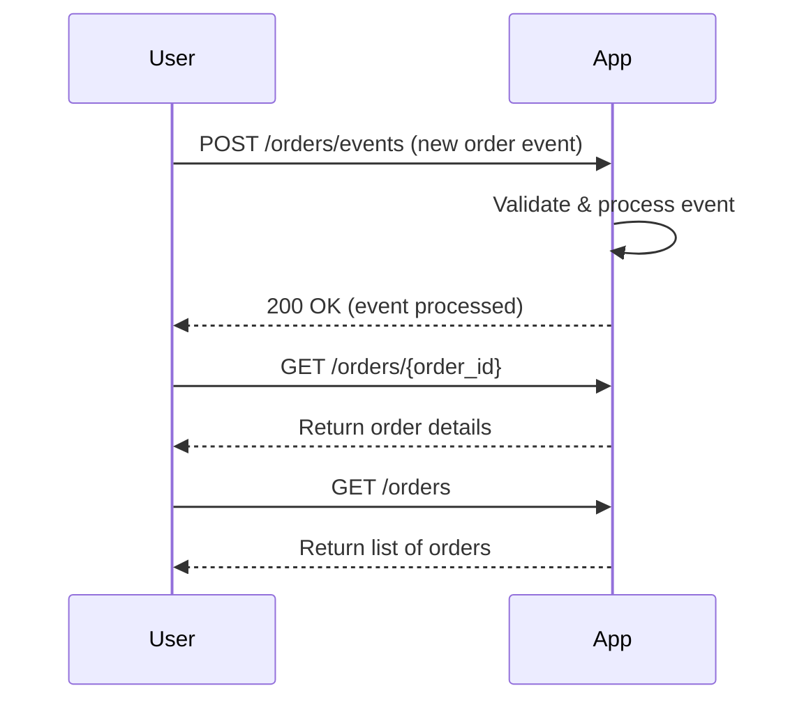
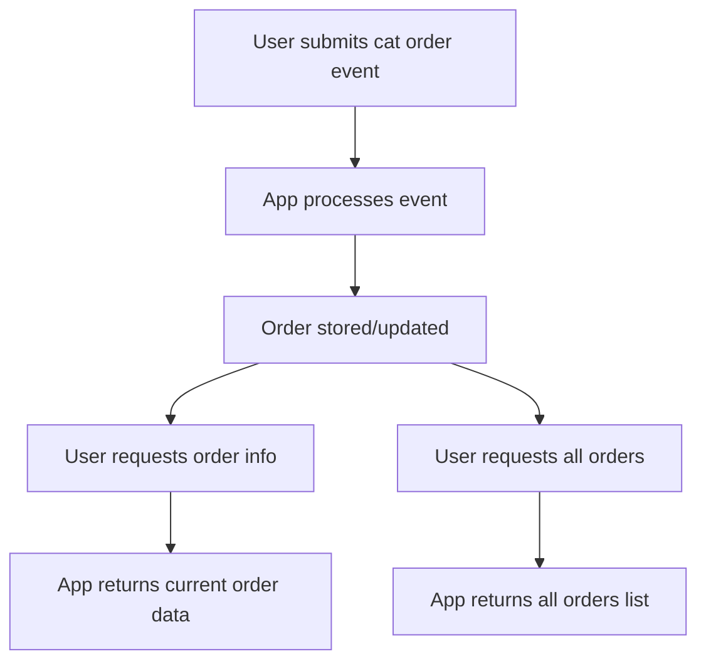

```markdown
# Functional Requirements for Cat Orders Events Application

## API Endpoints

### 1. POST /orders/events  
**Description:** Receive and process cat order events (e.g., new order created, updated, canceled).  
**Request Body (JSON):**  
```json
{
  "event_type": "string",    // "created", "updated", "canceled"
  "order_id": "string",
  "cat_type": "string",      // e.g. "siamese", "persian"
  "quantity": "integer",
  "price": "number",
  "timestamp": "string"      // ISO 8601 datetime
}
```  
**Response (JSON):**  
```json
{
  "status": "success",
  "message": "Event processed",
  "order_id": "string"
}
```

---

### 2. GET /orders/{order_id}  
**Description:** Retrieve the current state/details of a specific order by ID.  
**Response (JSON):**  
```json
{
  "order_id": "string",
  "cat_type": "string",
  "quantity": "integer",
  "price": "number",
  "status": "string",         // e.g., "created", "updated", "canceled"
  "last_updated": "string"    // ISO 8601 datetime
}
```

---

### 3. GET /orders  
**Description:** Retrieve the list of all orders with their current status.  
**Response (JSON):**  
```json
[
  {
    "order_id": "string",
    "cat_type": "string",
    "quantity": "integer",
    "price": "number",
    "status": "string",
    "last_updated": "string"
  },
  ...
]
```

---

## Business Logic Notes
- All event processing (validation, state updates, possible external data calls) happens in the `POST /orders/events` endpoint.
- GET endpoints are read-only and return stored state only.

---

## User-App Interaction Sequence Diagram



---

## User Journey Diagram


```