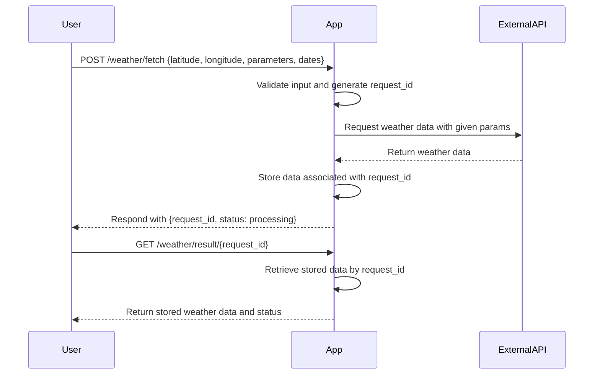

```markdown
# Functional Requirements for Weather Data Fetching App

## API Endpoints

### 1. `POST /weather/fetch`
- **Purpose**: Trigger fetching of weather data from the external API (https://api.open-meteo.com/v1/forecast) based on user input.
- **Request Body** (JSON):
  ```json
  {
    "latitude": 51.5074,
    "longitude": -0.1278,
    "parameters": ["temperature_2m", "precipitation", "windspeed_10m"],
    "start_date": "2024-06-01",
    "end_date": "2024-06-02"
  }
  ```
  - `latitude` (float, required): Latitude of the location.
  - `longitude` (float, required): Longitude of the location.
  - `parameters` (array of strings, required): List of weather parameters to fetch.
  - `start_date` (string, optional): Start date for forecast (ISO format).
  - `end_date` (string, optional): End date for forecast (ISO format).

- **Response** (JSON):
  ```json
  {
    "request_id": "uuid-1234",
    "status": "processing"
  }
  ```
  - `request_id` (string): Unique ID for the fetch request.
  - `status` (string): Status of the fetch job (e.g., "processing").

- **Business Logic**:
  - Validate input.
  - Call external API with given parameters.
  - Store fetched data internally, associated with `request_id`.
  - Return `request_id` for data retrieval.

---

### 2. `GET /weather/result/{request_id}`
- **Purpose**: Retrieve stored weather data for the given fetch request.
- **Path Parameter**:
  - `request_id` (string): The unique ID returned by the `POST` request.

- **Response** (JSON):
  ```json
  {
    "request_id": "uuid-1234",
    "location": {
      "latitude": 51.5074,
      "longitude": -0.1278
    },
    "parameters": ["temperature_2m", "precipitation", "windspeed_10m"],
    "data": {...},  // The raw or processed weather data returned by external API
    "status": "completed"
  }
  ```
  - `status` can be `"processing"`, `"completed"`, or `"failed"`.

---

## User-App Interaction Sequence Diagram


```