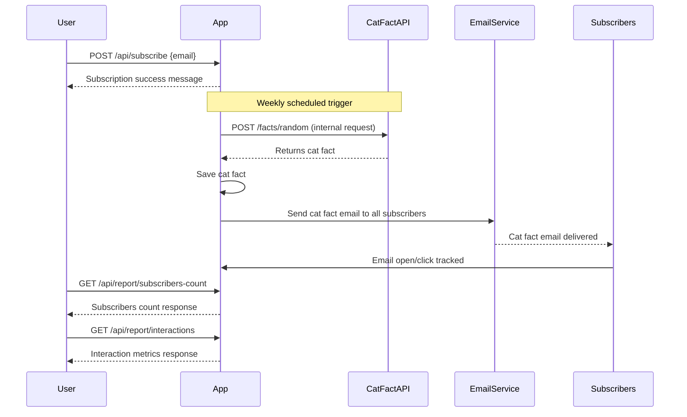

```markdown
# Functional Requirements for Weekly Cat Fact Subscription Application

## API Endpoints

### 1. User Sign-up
- **Endpoint:** `POST /api/subscribe`
- **Description:** Register a new subscriber using their email address.
- **Request:**
  ```json
  {
    "email": "user@example.com"
  }
  ```
- **Response:**
  ```json
  {
    "success": true,
    "message": "Subscription successful"
  }
  ```

---

### 2. Trigger Weekly Cat Fact Retrieval and Email Sending
- **Endpoint:** `POST /api/facts/send-weekly`
- **Description:** Retrieve a new cat fact from the external Cat Fact API, save it, and send it via email to all subscribers.
- **Request:** No body required.
- **Response:**
  ```json
  {
    "success": true,
    "sentTo": 123,
    "fact": "Cats have five toes on their front paws, but only four toes on their back paws."
  }
  ```

---

### 3. Get Subscribers Count
- **Endpoint:** `GET /api/report/subscribers-count`
- **Description:** Fetch the current total number of subscribers.
- **Response:**
  ```json
  {
    "subscribersCount": 123
  }
  ```

---

### 4. Get Email Interaction Metrics
- **Endpoint:** `GET /api/report/interactions`
- **Description:** Retrieve aggregated interaction data for sent cat fact emails, such as opens and clicks.
- **Response:**
  ```json
  {
    "totalEmailsSent": 456,
    "totalOpens": 300,
    "totalClicks": 150
  }
  ```

---

## User-App Interaction Sequence


```