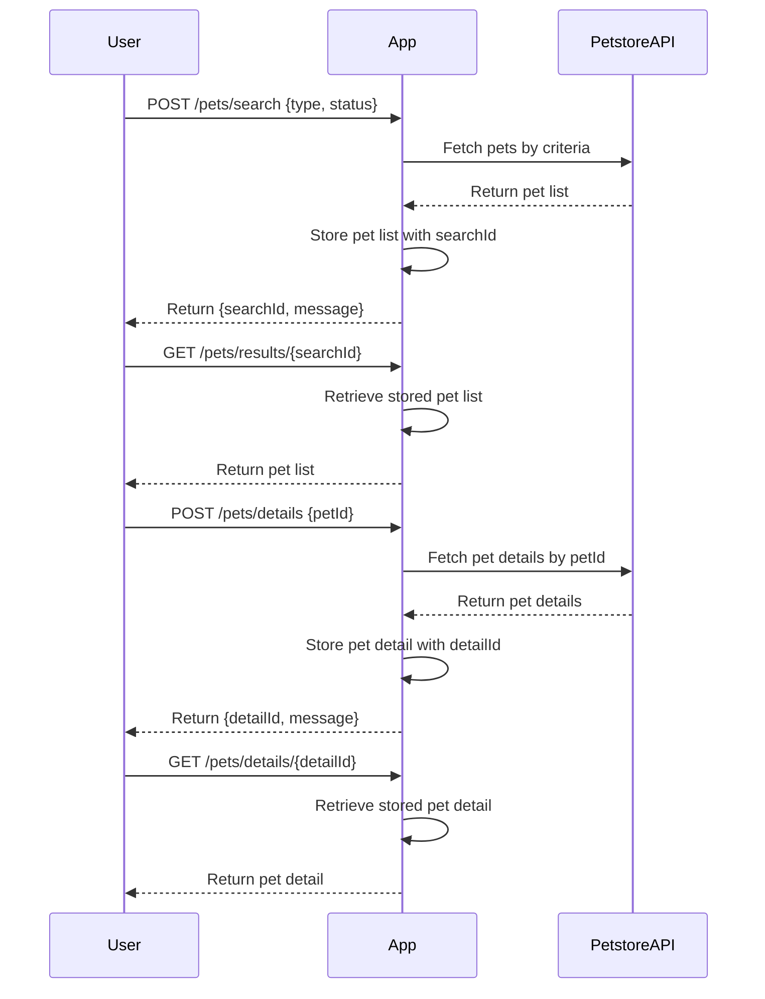

```markdown
# Purrfect Pets API - Functional Requirements

## API Endpoints

### 1. POST /pets/search  
**Description:** Search pets by criteria (e.g., type, status). This endpoint calls the external Petstore API, processes results, and stores them internally for retrieval.  
**Request:**  
```json
{
  "type": "string",       // optional, e.g., "dog", "cat"
  "status": "string"      // optional, e.g., "available", "sold"
}
```  
**Response:**  
```json
{
  "searchId": "string",   // unique id to retrieve results
  "message": "Search started"
}
```

---

### 2. GET /pets/results/{searchId}  
**Description:** Retrieve search results previously fetched and stored by POST /pets/search.  
**Response:**  
```json
{
  "searchId": "string",
  "pets": [
    {
      "id": "integer",
      "name": "string",
      "type": "string",
      "status": "string",
      "photoUrls": ["string"]
    }
  ]
}
```

---

### 3. POST /pets/details  
**Description:** Retrieve detailed pet info by pet id (calls external API, stores results).  
**Request:**  
```json
{
  "petId": "integer"
}
```  
**Response:**  
```json
{
  "detailId": "string",
  "message": "Detail fetch started"
}
```

---

### 4. GET /pets/details/{detailId}  
**Description:** Retrieve detailed pet info previously fetched and stored by POST /pets/details.  
**Response:**  
```json
{
  "detailId": "string",
  "pet": {
    "id": "integer",
    "name": "string",
    "type": "string",
    "status": "string",
    "photoUrls": ["string"],
    "description": "string"
  }
}
```

---

## Business Logic Notes

- POST endpoints trigger external Petstore API calls, process and store data internally.
- GET endpoints return stored data by searchId or detailId.
- This separation ensures GET is only for retrieval of internal data.

---

## User-App Interaction Sequence


```