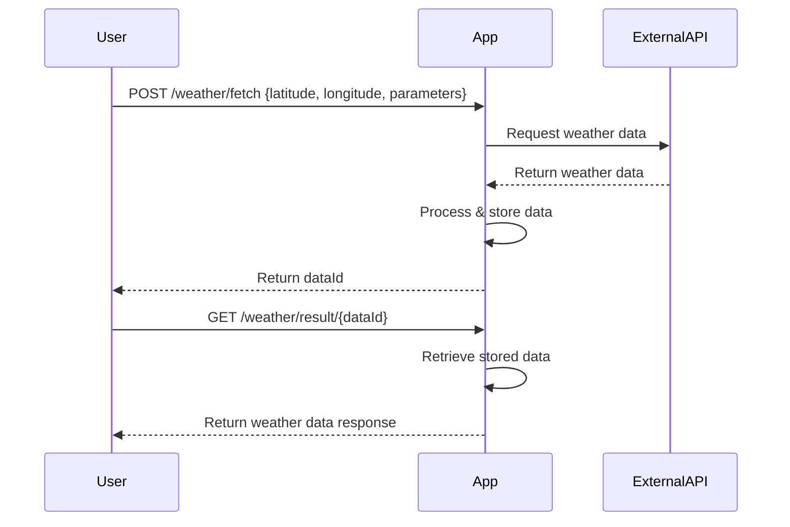
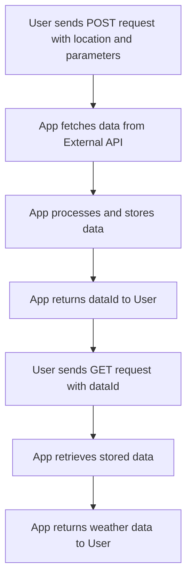

```markdown
# Functional Requirements for Weather Data Fetching App

## API Endpoints

### 1. POST /weather/fetch
- **Purpose:** Fetch weather data from the external API based on user input (location, parameters).
- **Request Body:**
  ```json
  {
    "latitude": 52.52,
    "longitude": 13.405,
    "parameters": ["temperature_2m", "humidity_2m"]
  }
  ```
- **Response:**
  ```json
  {
    "status": "success",
    "message": "Weather data fetched and stored",
    "dataId": "123abc"
  }
  ```
- **Business Logic:**  
  - Validate input.
  - Call `https://api.open-meteo.com/v1/forecast` with given latitude, longitude, and parameters.
  - Process and store the result internally linked to `dataId`.
  - Return success response with `dataId`.

---

### 2. GET /weather/result/{dataId}
- **Purpose:** Retrieve stored weather data results by `dataId`.
- **Response:**
  ```json
  {
    "dataId": "123abc",
    "latitude": 52.52,
    "longitude": 13.405,
    "parameters": {
      "temperature_2m": 18.5,
      "humidity_2m": 65
    },
    "timestamp": "2024-06-10T15:00:00Z"
  }
  ```
- **Business Logic:**  
  - Lookup stored data by `dataId`.
  - Return stored weather data.

---

## User-App Interaction Sequence Diagram



---

## User Journey Diagram


```