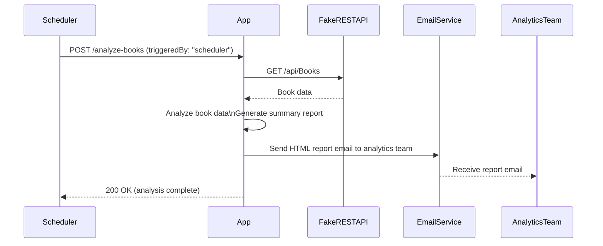
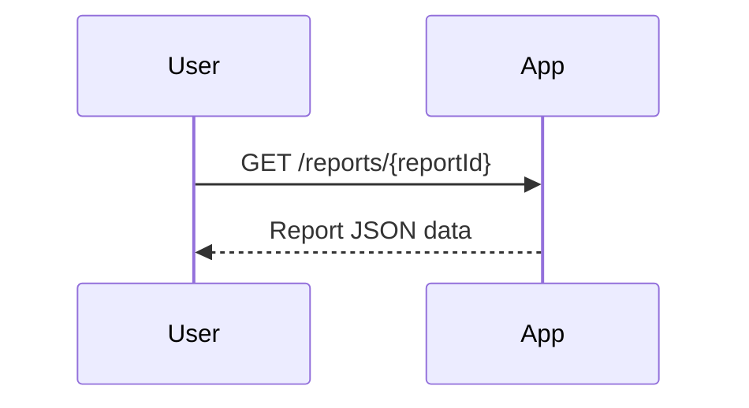

```markdown
# Functional Requirements for Book Analytics Application

## API Endpoints

### 1. POST /analyze-books
- **Purpose:** Trigger data retrieval from the Fake REST API, analyze the book data, generate a summary report, and email it to the analytics team.
- **Request:**
  ```json
  {
    "triggeredBy": "scheduler" | "manual",
    "date": "YYYY-MM-DD"  // optional, defaults to current date
  }
  ```
- **Response:**
  ```json
  {
    "status": "success",
    "message": "Book data analyzed and report generated.",
    "reportId": "string"
  }
  ```
- **Business Logic:**
  - Retrieve book data from the Fake REST API.
  - Analyze key metrics: total page counts, publication dates, popular titles (highest page count).
  - Generate a summary report including:
    - Insights on book titles,
    - Total page counts,
    - Publication dates,
    - Brief description and excerpt of popular titles.
  - Email the report as an HTML email to the analytics team (analytics@example.com).

### 2. GET /reports/{reportId}
- **Purpose:** Retrieve the generated report by its ID.
- **Request Parameters:**  
  - `reportId` (path parameter): Identifier of the report.
- **Response:**
  ```json
  {
    "reportId": "string",
    "generatedOn": "YYYY-MM-DDTHH:mm:ssZ",
    "totalBooks": integer,
    "totalPageCount": integer,
    "publicationDateRange": {
      "earliest": "YYYY-MM-DD",
      "latest": "YYYY-MM-DD"
    },
    "popularTitles": [
      {
        "id": integer,
        "title": "string",
        "description": "string",
        "excerpt": "string",
        "pageCount": integer,
        "publishDate": "YYYY-MM-DD"
      }
    ],
    "summary": "string"
  }
  ```

---

## User-App Interaction Sequence Diagram



---

## User Retrieval Flow


```