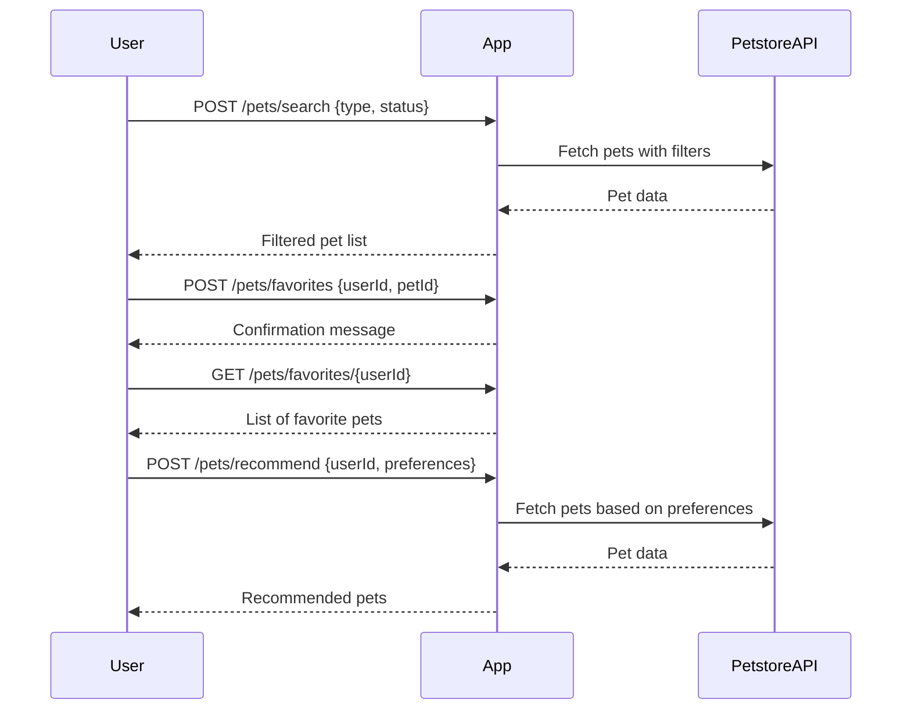

```markdown
# Purrfect Pets API - Functional Requirements

## API Endpoints

### 1. **POST /pets/search**
- **Description:** Search pets by type, status, or other filters. Retrieves data from external Petstore API and applies any filtering or business logic.
- **Request Body:**
```json
{
  "type": "string",        // e.g. "cat", "dog", optional
  "status": "string",      // e.g. "available", "sold", optional
  "name": "string"         // optional partial match
}
```
- **Response:**
```json
{
  "pets": [
    {
      "id": 123,
      "name": "Fluffy",
      "type": "cat",
      "status": "available",
      "photoUrls": ["url1", "url2"]
    }
  ]
}
```

---

### 2. **POST /pets/favorites**
- **Description:** Add a pet to the user’s favorites. Business logic stores favorites (in-memory or DB).
- **Request Body:**
```json
{
  "userId": "string",
  "petId": 123
}
```
- **Response:**
```json
{
  "message": "Pet added to favorites"
}
```

---

### 3. **GET /pets/favorites/{userId}**
- **Description:** Retrieve the list of favorite pets for a given user.
- **Response:**
```json
{
  "favorites": [
    {
      "id": 123,
      "name": "Fluffy",
      "type": "cat",
      "status": "available"
    }
  ]
}
```

---

### 4. **POST /pets/recommend**
- **Description:** Provide pet recommendations based on user preferences or past favorites. This endpoint runs business logic on external and local data.
- **Request Body:**
```json
{
  "userId": "string",
  "preferences": {
    "type": "cat",
    "status": "available"
  }
}
```
- **Response:**
```json
{
  "recommendations": [
    {
      "id": 456,
      "name": "Whiskers",
      "type": "cat",
      "status": "available"
    }
  ]
}
```

---

## User-App Interaction Sequence Diagram



---

## Summary
- External data fetching & business logic happen in **POST** endpoints.
- **GET** endpoints only retrieve stored or computed results.
- Supports searching pets, managing favorites, and personalized recommendations.
```