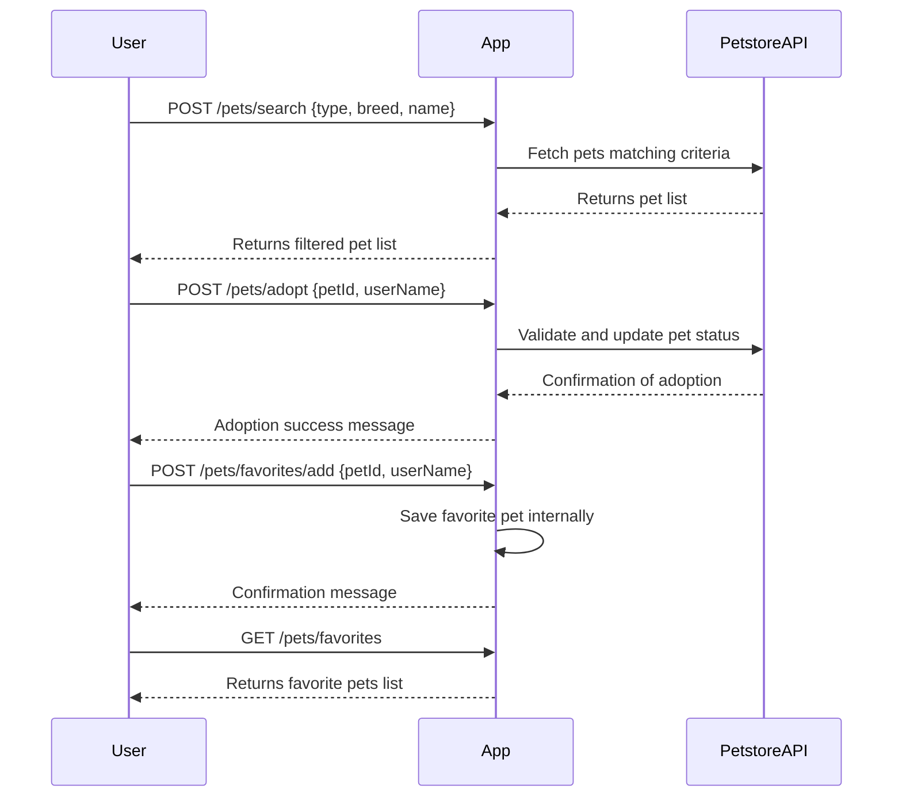

```markdown
# Purrfect Pets API - Functional Requirements

## Overview  
The app integrates with the Petstore API to provide pet data. All external data fetching or business logic happens in POST endpoints. GET endpoints serve cached or processed results.

---

## API Endpoints

### 1. **POST /pets/search**  
Search pets by type, breed, or name (invokes Petstore API).  
- **Request (JSON):**
  ```json
  {
    "type": "string",      // optional, e.g. "cat", "dog"
    "breed": "string",     // optional
    "name": "string"       // optional, partial or full name match
  }
  ```  
- **Response (JSON):**
  ```json
  {
    "pets": [
      {
        "id": "string",
        "name": "string",
        "type": "string",
        "breed": "string",
        "age": "integer",
        "status": "string"    // e.g. available, adopted
      }
    ]
  }
  ```

---

### 2. **POST /pets/adopt**  
Request adoption of a pet (validates availability and updates status).  
- **Request (JSON):**
  ```json
  {
    "petId": "string",
    "userName": "string"
  }
  ```  
- **Response (JSON):**
  ```json
  {
    "success": true,
    "message": "Adoption request confirmed."
  }
  ```

---

### 3. **GET /pets/favorites**  
Retrieve a list of favorite pets saved by the user (stored internally).  
- **Response (JSON):**
  ```json
  {
    "favorites": [
      {
        "id": "string",
        "name": "string",
        "type": "string",
        "breed": "string"
      }
    ]
  }
  ```

---

### 4. **POST /pets/favorites/add**  
Add a pet to user’s favorites.  
- **Request (JSON):**
  ```json
  {
    "petId": "string",
    "userName": "string"
  }
  ```  
- **Response (JSON):**
  ```json
  {
    "success": true,
    "message": "Pet added to favorites."
  }
  ```

---

## User-App Interaction Sequence


```