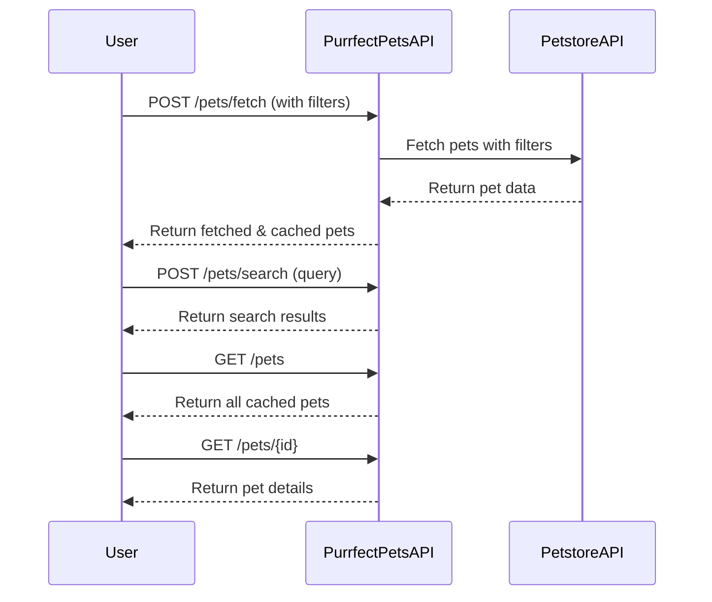

```markdown
# Purrfect Pets API - Functional Requirements

## Overview
"Purrfect Pets" API app integrates with the Petstore API to provide pet-related data. The app follows RESTful principles with these rules:
- **POST endpoints** invoke external data sources, perform business logic, or calculations.
- **GET endpoints** retrieve data stored or processed internally within the app.

---

## API Endpoints

### 1. POST /pets/fetch
- **Description:** Fetch pet data from the external Petstore API based on optional filters.
- **Request Body:**
  ```json
  {
    "status": "available" | "pending" | "sold",  // optional filter
    "tags": ["cute", "small"],                   // optional filter
    "limit": 10                                  // optional max number of pets
  }
  ```
- **Response:**
  ```json
  {
    "fetched": 8,
    "pets": [
      {
        "id": 1,
        "name": "Fluffy",
        "category": "cat",
        "status": "available",
        "tags": ["cute", "small"]
      }
      // ...
    ]
  }
  ```
- **Business Logic:** Fetches data from Petstore API applying filters, caches results internally.

---

### 2. POST /pets/search
- **Description:** Search cached pets by name or category.
- **Request Body:**
  ```json
  {
    "query": "cat",
    "status": "available"   // optional
  }
  ```
- **Response:**
  ```json
  {
    "results": [
      {
        "id": 1,
        "name": "Fluffy",
        "category": "cat",
        "status": "available"
      }
      // ...
    ]
  }
  ```

---

### 3. GET /pets
- **Description:** Retrieve all cached pets.
- **Response:**
  ```json
  {
    "pets": [
      {
        "id": 1,
        "name": "Fluffy",
        "category": "cat",
        "status": "available",
        "tags": ["cute", "small"]
      }
      // ...
    ]
  }
  ```

---

### 4. GET /pets/{id}
- **Description:** Retrieve a specific cached pet by its ID.
- **Response:**
  ```json
  {
    "id": 1,
    "name": "Fluffy",
    "category": "cat",
    "status": "available",
    "tags": ["cute", "small"]
  }
  ```

---

## User-App Interaction Sequence


```