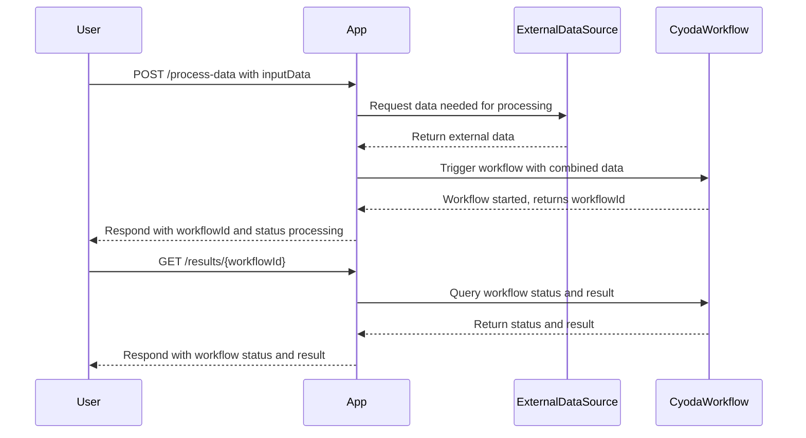

```markdown
# Functional Requirements and API Design

## API Endpoints

### 1. POST `/process-data`
- **Description:** Accepts input data, invokes external data sources or performs calculations, triggers workflows in Cyoda.
- **Request Format:** JSON  
  ```json
  {
    "inputData": { /* arbitrary structured input */ }
  }
  ```
- **Response Format:** JSON  
  ```json
  {
    "status": "processing",
    "workflowId": "string"
  }
  ```

---

### 2. GET `/results/{workflowId}`
- **Description:** Retrieves the results of a previously processed workflow by its ID.
- **Response Format:** JSON  
  ```json
  {
    "workflowId": "string",
    "status": "completed|pending|failed",
    "result": { /* output data or error info */ }
  }
  ```

---

## Business Logic Rules
- All external data retrieval or complex calculations happen in the POST `/process-data` endpoint.
- GET `/results/{workflowId}` only returns stored results from the application state.
- Workflows are triggered on POST requests, utilizing Cyoda’s entity and workflow model.

---

## User-App Interaction Sequence



---

## Overview Journey Diagram

```mermaid
flowchart TD
    A[User sends POST /process-data] --> B{App processes request}
    B --> C[Retrieve external data]
    C --> D[Trigger Cyoda workflow]
    D --> E[Return workflowId to User]
    E --> F[User polls GET /results/{workflowId}]
    F --> G{Workflow completed?}
    G -- Yes --> H[Return results]
    G -- No --> F
```
```