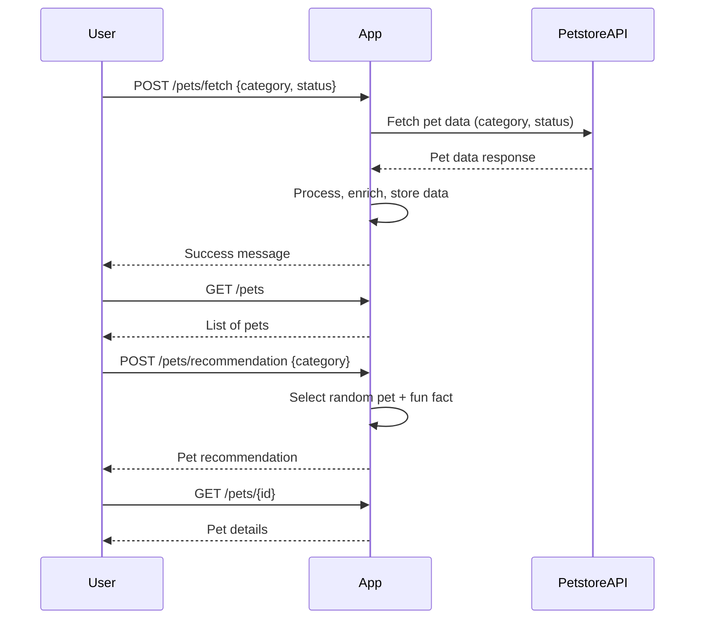

```markdown
# Purrfect Pets API - Functional Requirements

## Overview
The "Purrfect Pets" API provides pet data enriched with fun features using Petstore API data. External data fetching and business logic happens only in POST endpoints. GET endpoints serve cached or processed results.

---

## API Endpoints

### 1. POST /pets/fetch
- **Purpose:** Fetch pet data from Petstore API (external source) and optionally enrich or store it.
- **Request:**
```json
{
  "category": "string (optional)",  // e.g., "cats", "dogs"
  "status": "string (optional)"     // e.g., "available", "sold"
}
```
- **Response:**
```json
{
  "message": "Fetched and processed pet data successfully",
  "count": "number of pets fetched"
}
```

---

### 2. GET /pets
- **Purpose:** Retrieve list of pets fetched and stored/enriched in the app.
- **Request:** None
- **Response:**
```json
[
  {
    "id": "integer",
    "name": "string",
    "category": "string",
    "status": "string",
    "funFact": "string (optional)"
  },
  ...
]
```

---

### 3. POST /pets/recommendation
- **Purpose:** Generate a fun pet recommendation with a cute fact based on stored pet data.
- **Request:**
```json
{
  "category": "string (optional)"
}
```
- **Response:**
```json
{
  "id": "integer",
  "name": "string",
  "category": "string",
  "status": "string",
  "funFact": "string"
}
```

---

### 4. GET /pets/{id}
- **Purpose:** Retrieve detailed info about a specific pet by ID.
- **Request:** None
- **Response:**
```json
{
  "id": "integer",
  "name": "string",
  "category": "string",
  "status": "string",
  "description": "string (optional)",
  "funFact": "string (optional)"
}
```

---

## User-App Interaction Sequence



---

## Notes
- All POST endpoints handle external data fetching and business logic.
- GET endpoints serve cached or processed results only.
- Fun facts can be static or dynamically generated text about pets.
```