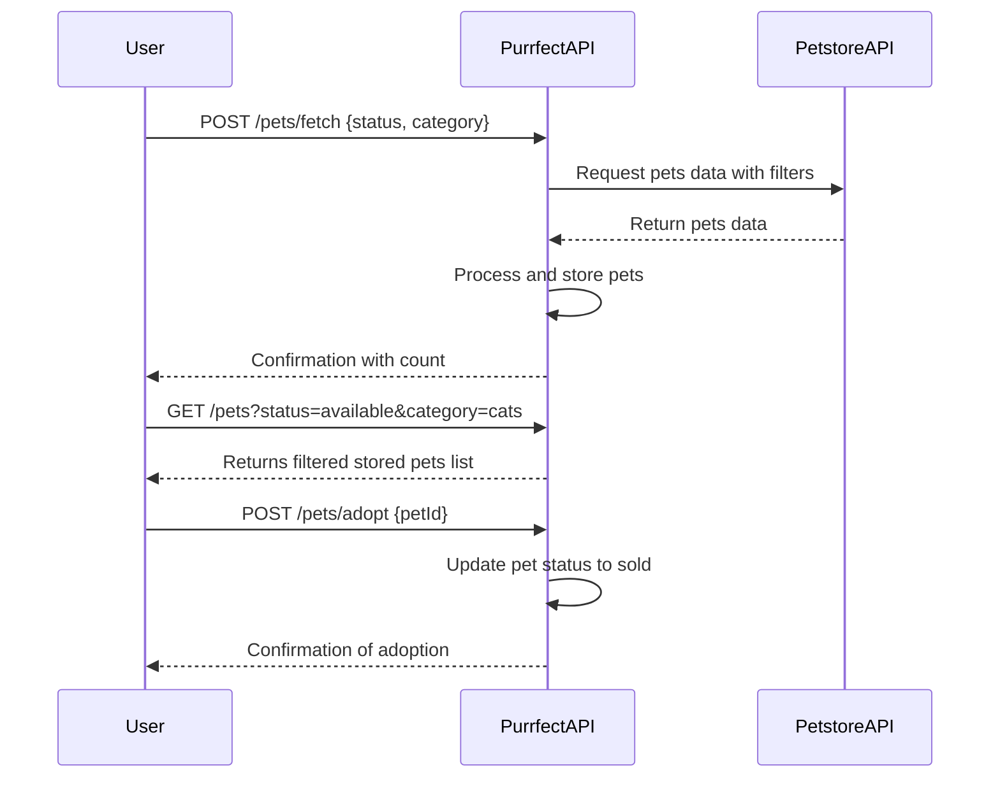
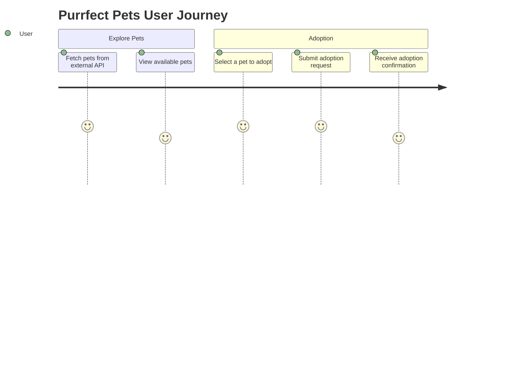

```markdown
# Purrfect Pets API - Functional Requirements

## Overview
The "Purrfect Pets" API app fetches and processes pet data from the external Petstore API.  
- All external data fetch or business logic is triggered via **POST** endpoints.  
- **GET** endpoints are used only to retrieve processed or stored results within our app.

---

## API Endpoints

### 1. Fetch Pets Data  
**POST** `/pets/fetch`  
- **Purpose:** Retrieve pet data from Petstore API, optionally filter or transform it, and store it in the app for later retrieval.  
- **Request (application/json):**  
```json
{
  "status": "available",          // optional: filter pets by status (available, pending, sold)
  "category": "cats"              // optional: filter by category
}
```
- **Response (application/json):**  
```json
{
  "message": "Pets data fetched and stored.",
  "count": 20
}
```

---

### 2. Get Stored Pets List  
**GET** `/pets`  
- **Purpose:** Retrieve pets stored by the application from previous fetches. Supports query params for pagination or filtering.  
- **Query parameters:**  
  - `status` (optional)  
  - `category` (optional)  
  - `limit` (optional, default 20)  
  - `offset` (optional, default 0)  
- **Response (application/json):**  
```json
{
  "pets": [
    {
      "id": 123,
      "name": "Whiskers",
      "category": "cats",
      "status": "available"
    },
    ...
  ],
  "total": 50,
  "limit": 20,
  "offset": 0
}
```

---

### 3. Adopt a Pet (Business Logic Example)  
**POST** `/pets/adopt`  
- **Purpose:** Mark a pet as adopted (change status to "sold") in the app and optionally update external Petstore API (if supported).  
- **Request (application/json):**  
```json
{
  "petId": 123
}
```
- **Response (application/json):**  
```json
{
  "message": "Pet 123 adopted successfully.",
  "pet": {
    "id": 123,
    "status": "sold"
  }
}
```

---

## Mermaid Sequence Diagram - User Interaction with Purrfect Pets API



---

## Mermaid Journey Diagram - User Pet Adoption Flow


```