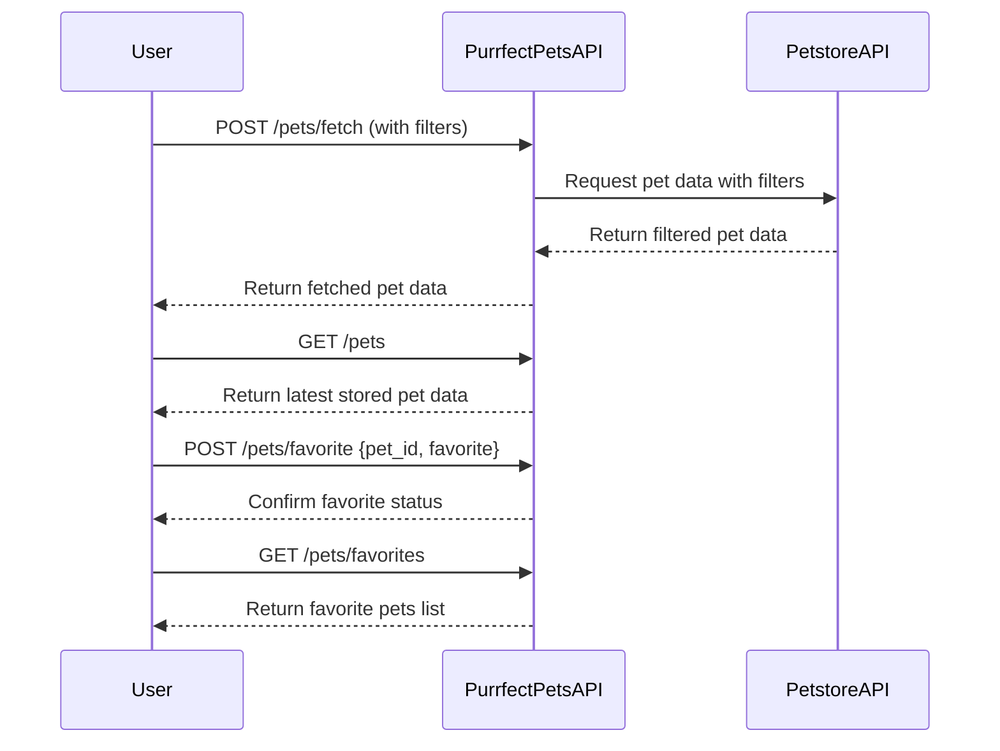
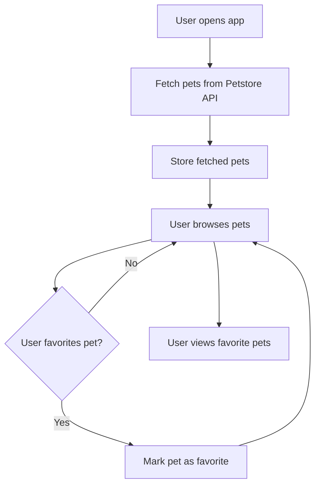

```markdown
# Purrfect Pets API - Functional Requirements

## API Endpoints

### 1. POST /pets/fetch
- **Description:** Fetch pet data from the external Petstore API based on provided filters or parameters.
- **Request:**
  ```json
  {
    "category": "string",          // optional: e.g. "cat", "dog", "bird"
    "status": "string",            // optional: e.g. "available", "sold", "pending"
    "limit": 10                   // optional: number of pets to fetch
  }
  ```
- **Response:**
  ```json
  {
    "fetched_at": "ISO8601 timestamp",
    "total": 100,
    "pets": [
      {
        "id": 1,
        "name": "Fluffy",
        "category": "cat",
        "status": "available",
        "photoUrls": ["url1", "url2"],
        "tags": ["cute", "small"]
      }
    ]
  }
  ```

### 2. GET /pets
- **Description:** Retrieve the latest fetched pet data stored in the application.
- **Request:** None
- **Response:**
  ```json
  {
    "fetched_at": "ISO8601 timestamp",
    "total": 100,
    "pets": [
      {
        "id": 1,
        "name": "Fluffy",
        "category": "cat",
        "status": "available",
        "photoUrls": ["url1", "url2"],
        "tags": ["cute", "small"]
      }
    ]
  }
  ```

### 3. POST /pets/favorite
- **Description:** Mark or unmark a pet as favorite.
- **Request:**
  ```json
  {
    "pet_id": 1,
    "favorite": true
  }
  ```
- **Response:**
  ```json
  {
    "pet_id": 1,
    "favorite": true,
    "message": "Pet marked as favorite"
  }
  ```

### 4. GET /pets/favorites
- **Description:** Retrieve the list of favorite pets.
- **Request:** None
- **Response:**
  ```json
  {
    "favorites": [
      {
        "id": 1,
        "name": "Fluffy",
        "category": "cat",
        "status": "available",
        "photoUrls": ["url1"],
        "tags": ["cute"]
      }
    ]
  }
  ```

---

## Business Logic Notes
- External Petstore API data fetching and filtering occurs only in POST `/pets/fetch`.
- GET endpoints serve cached or stored data inside the app.
- Favoriting pets is a local operation stored within the app, managed via POST `/pets/favorite`.

---

## User-App Interaction Sequence Diagram



---

## User Journey Diagram


```