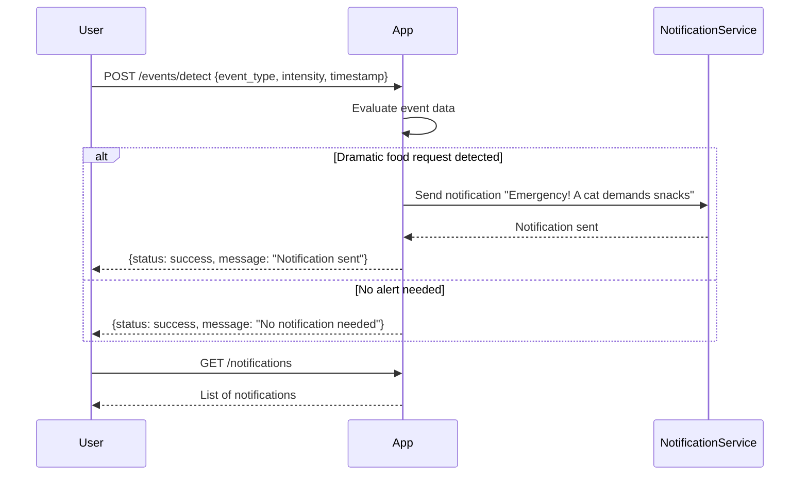

```markdown
# Functional Requirements for Cat Event Detection App

## API Endpoints

### 1. POST /events/detect
- **Purpose:** Receive cat event data (e.g., dramatic food requests), process it, and trigger notifications if necessary.
- **Request Body (JSON):**
  ```json
  {
    "event_type": "string",       // e.g. "food_request"
    "intensity": "string",        // e.g. "dramatic", "normal"
    "timestamp": "string"         // ISO8601 datetime string
  }
  ```
- **Response (JSON):**
  ```json
  {
    "status": "success",
    "message": "Notification sent" | "No notification needed"
  }
  ```
- **Business Logic:** 
  - Evaluate `event_type` and `intensity`.
  - If `event_type == "food_request"` and `intensity == "dramatic"`, send notification:  
    `'Emergency! A cat demands snacks'`.
  - Otherwise, no notification.

---

### 2. GET /notifications
- **Purpose:** Retrieve a list of past notifications sent by the app.
- **Response (JSON):**
  ```json
  {
    "notifications": [
      {
        "timestamp": "string",       // ISO8601 datetime string
        "message": "string"
      },
      ...
    ]
  }
  ```

---

## User-App Interaction Sequence


```