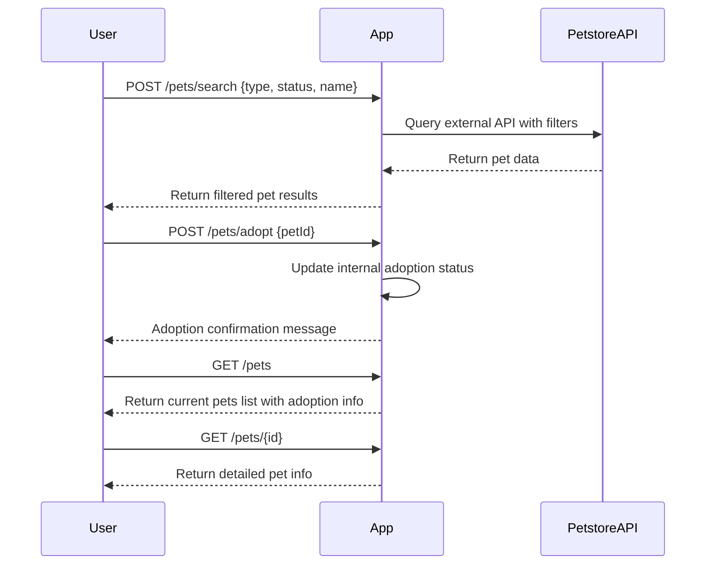

```markdown
# Purrfect Pets API - Functional Requirements

## Overview
The API interacts with the Petstore external API data via POST endpoints for data retrieval or any business logic, while GET endpoints serve the app's processed results to the client. The app focuses on pet data management and fun interactions.

---

## API Endpoints

### 1. POST `/pets/search`
- **Description:** Search pets by type, status, or name using Petstore API.
- **Request Body (JSON):**
  ```json
  {
    "type": "string",         // optional, e.g. "cat", "dog"
    "status": "string",       // optional, e.g. "available", "sold"
    "name": "string"          // optional, partial or full pet name
  }
  ```
- **Response (JSON):**
  ```json
  {
    "results": [
      {
        "id": "integer",
        "name": "string",
        "type": "string",
        "status": "string",
        "photoUrls": ["string"]
      },
      ...
    ]
  }
  ```

---

### 2. POST `/pets/adopt`
- **Description:** Simulate adopting a pet by providing pet ID; updates internal adoption status.
- **Request Body (JSON):**
  ```json
  {
    "petId": "integer"
  }
  ```
- **Response (JSON):**
  ```json
  {
    "adopted": true,
    "petId": "integer",
    "message": "string"
  }
  ```

---

### 3. GET `/pets`
- **Description:** Retrieve the list of pets currently fetched or adopted in the app context.
- **Response (JSON):**
  ```json
  {
    "pets": [
      {
        "id": "integer",
        "name": "string",
        "type": "string",
        "status": "string",
        "adopted": "boolean",
        "photoUrls": ["string"]
      },
      ...
    ]
  }
  ```

---

### 4. GET `/pets/{id}`
- **Description:** Retrieve detailed info of a specific pet by ID.
- **Response (JSON):**
  ```json
  {
    "id": "integer",
    "name": "string",
    "type": "string",
    "status": "string",
    "adopted": "boolean",
    "photoUrls": ["string"],
    "description": "string"  // optional fun detail
  }
  ```

---

## User-App Interaction Sequence



---

## Notes
- POST endpoints trigger external API calls or internal state changes.
- GET endpoints serve app-managed data only.
- Adoption is simulated internally; no external API update.
- All data exchange uses JSON format.
```
