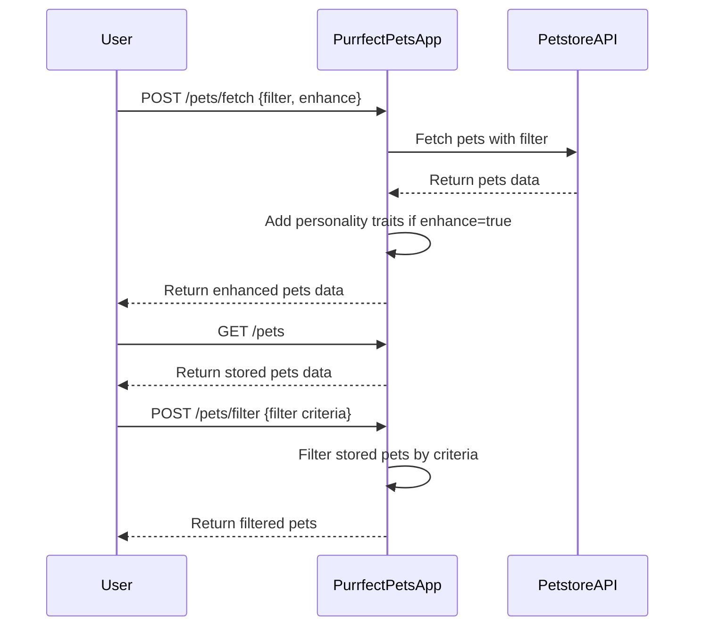
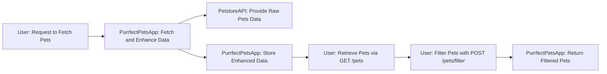

```markdown
# Purrfect Pets API - Functional Requirements

## API Endpoints

### 1. POST /pets/fetch  
**Description:** Fetch pets data from external Petstore API, optionally apply fun enhancements (e.g., add personality traits).  
**Request:**  
```json
{
  "filter": {
    "status": "available",          // optional, e.g. "available", "sold", "pending"
    "type": "cat"                  // optional, e.g. "cat", "dog"
  },
  "enhance": true                  // optional, whether to add fun traits
}
```  
**Response:**  
```json
{
  "pets": [
    {
      "id": 123,
      "name": "Whiskers",
      "type": "cat",
      "status": "available",
      "personality": "playful and curious"    // added if enhance=true
    },
    ...
  ]
}
```

---

### 2. GET /pets  
**Description:** Retrieve the last fetched and optionally enhanced pets data from the app storage.  
**Request:** No body parameters.  
**Response:**  
```json
{
  "pets": [
    {
      "id": 123,
      "name": "Whiskers",
      "type": "cat",
      "status": "available",
      "personality": "playful and curious"
    },
    ...
  ]
}
```

---

### 3. POST /pets/filter  
**Description:** Filter stored pets by criteria (type, status, personality traits).  
**Request:**  
```json
{
  "filter": {
    "type": "dog",        // optional
    "status": "available",// optional
    "personality": "friendly" // optional keyword search in personality
  }
}
```  
**Response:**  
```json
{
  "pets": [
    {
      "id": 345,
      "name": "Buddy",
      "type": "dog",
      "status": "available",
      "personality": "friendly and loyal"
    },
    ...
  ]
}
```

---

## Business Logic Notes

- External Petstore API data fetching and any data enrichment or calculations are performed in POST endpoints (`/pets/fetch`).
- GET endpoints only return stored or cached results without contacting external services.
- Pet personality traits or other fun data are added as enhancements during the fetch process if requested.
- Filtering can be done either on the fetched data or stored data via POST `/pets/filter`.

---

## User-App Interaction Sequence


```mermaid
sequenceDiagram
  participant User
  participant PurrfectPetsApp
  participant PetstoreAPI

  User->>PurrfectPetsApp: POST /pets/fetch {filter, enhance}
  PurrfectPetsApp->>PetstoreAPI: Fetch pets with filter
  PetstoreAPI-->>PurrfectPetsApp: Return pets data
  PurrfectPetsApp->>PurrfectPetsApp: Add personality traits if enhance=true
  PurrfectPetsApp-->>User: Return enhanced pets data

  User->>PurrfectPetsApp: GET /pets
  PurrfectPetsApp-->>User: Return stored pets data

  User->>PurrfectPetsApp: POST /pets/filter {filter criteria}
  PurrfectPetsApp->>PurrfectPetsApp: Filter stored pets by criteria
  PurrfectPetsApp-->>User: Return filtered pets
```

---

## User Journey Overview


```mermaid
graph LR
  A[User: Request to Fetch Pets] --> B[PurrfectPetsApp: Fetch and Enhance Data]
  B --> C[PetstoreAPI: Provide Raw Pets Data]
  B --> D[PurrfectPetsApp: Store Enhanced Data]
  D --> E[User: Retrieve Pets via GET /pets]
  E --> F[User: Filter Pets with POST /pets/filter]
  F --> G[PurrfectPetsApp: Return Filtered Pets]
```
```