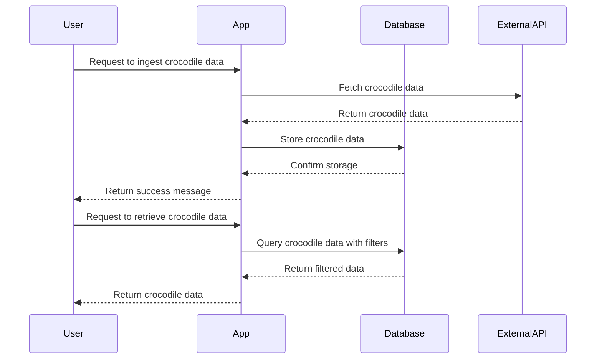
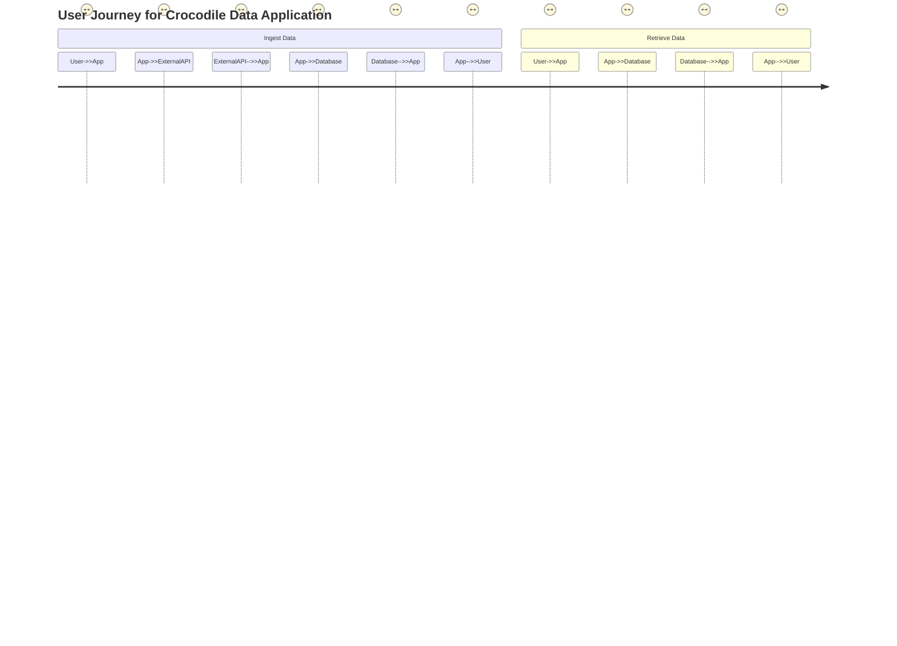

```markdown
# Functional Requirements for Crocodile Data Application

## Overview
The Crocodile Data Application will allow users to ingest, store, and filter crocodile data obtained from an external API. The application will adhere to RESTful principles and provide a clear interface for interaction.

## API Endpoints

### 1. Ingest Crocodile Data
- **Endpoint**: `POST /api/crocodiles/ingest`
- **Description**: Fetches crocodile data from the external API and stores it in the database.
- **Request Format**:
  ```json
  {
    "source": "https://test-api.k6.io/public/crocodiles/"
  }
  ```
- **Response Format**:
  ```json
  {
    "status": "success",
    "message": "Data ingested successfully",
    "count": <number_of_crocodiles_stored>
  }
  ```

### 2. Retrieve Crocodiles
- **Endpoint**: `GET /api/crocodiles/`
- **Description**: Retrieves stored crocodile data based on filter parameters.
- **Query Parameters**:
  - `name`: (optional) Filter by crocodile name.
  - `sex`: (optional) Filter by sex (M or F).
  - `min_age`: (optional) Minimum age for filtering.
  - `max_age`: (optional) Maximum age for filtering.
  
- **Response Format**:
  ```json
  {
    "status": "success",
    "data": [
      {
        "id": <crocodile_id>,
        "name": <crocodile_name>,
        "sex": <crocodile_sex>,
        "date_of_birth": <date_of_birth>,
        "age": <age>
      },
      ...
    ]
  }
  ```

## User-App Interaction Diagram


```mermaid
sequenceDiagram
    participant User
    participant App
    participant Database
    participant ExternalAPI

    User->>App: Request to ingest crocodile data
    App->>ExternalAPI: Fetch crocodile data
    ExternalAPI-->>App: Return crocodile data
    App->>Database: Store crocodile data
    Database-->>App: Confirm storage
    App-->>User: Return success message

    User->>App: Request to retrieve crocodile data
    App->>Database: Query crocodile data with filters
    Database-->>App: Return filtered data
    App-->>User: Return crocodile data
```


```mermaid
journey
    title User Journey for Crocodile Data Application
    section Ingest Data
      User->>App: Request to ingest crocodile data
      App->>ExternalAPI: Fetch crocodile data
      ExternalAPI-->>App: Return crocodile data
      App->>Database: Store crocodile data
      Database-->>App: Confirm storage
      App-->>User: Return success message
    section Retrieve Data
      User->>App: Request to retrieve crocodile data
      App->>Database: Query crocodile data with filters
      Database-->>App: Return filtered data
      App-->>User: Return crocodile data
```
```