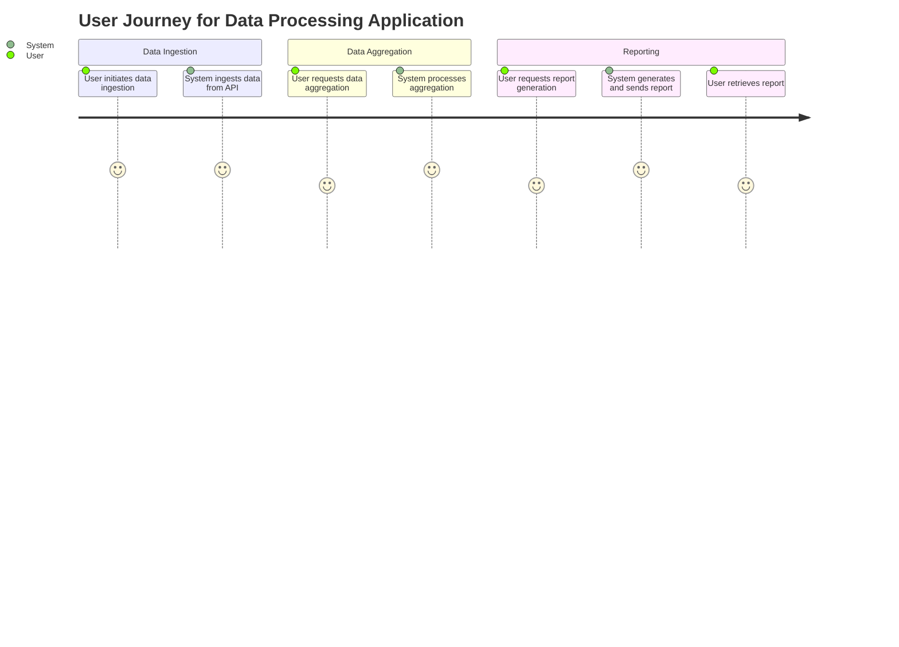
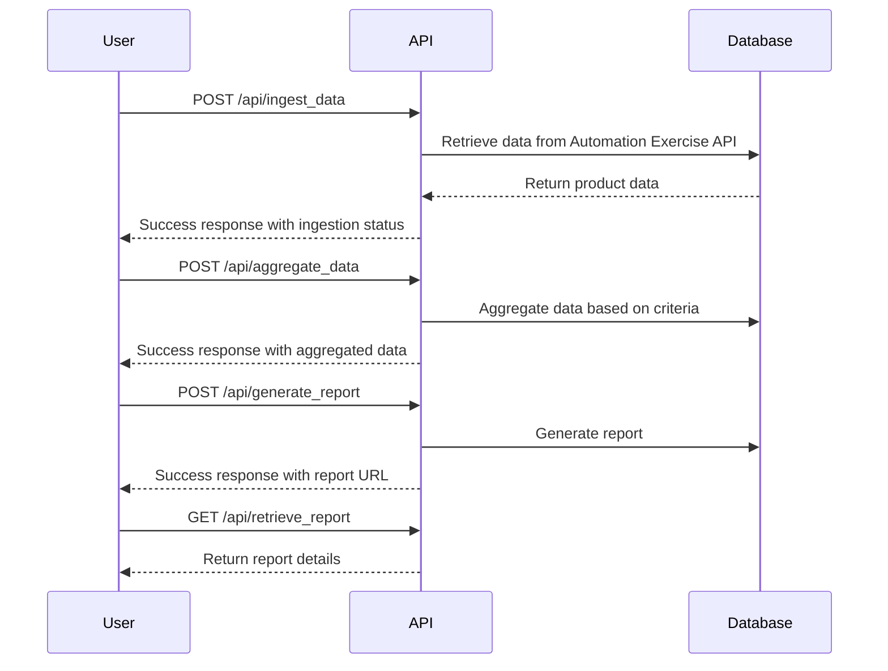

```markdown
# Final Functional Requirements for Backend Application

## Overview
The application will ingest product data from the Automation Exercise API, transform and aggregate the data, generate reports, and send notifications to the admin.

## API Endpoints

### 1. Data Ingestion Endpoint
- **Endpoint:** `/api/ingest_data`
- **Method:** POST
- **Description:** Ingests data from the Automation Exercise API.
- **Request Format:**
  ```json
  {
    "criteria": {
      "date": "YYYY-MM-DD"
    }
  }
  ```
- **Response Format:**
  ```json
  {
    "status": "success",
    "message": "Data ingested successfully",
    "data": {
      "total_products": 100,
      "ingested_at": "YYYY-MM-DDTHH:MM:SS"
    }
  }
  ```

### 2. Data Aggregation Endpoint
- **Endpoint:** `/api/aggregate_data`
- **Method:** POST
- **Description:** Aggregates the ingested data based on specified criteria.
- **Request Format:**
  ```json
  {
    "aggregation_criteria": {
      "field": "category",
      "operation": "sum"
    }
  }
  ```
- **Response Format:**
  ```json
  {
    "status": "success",
    "aggregated_data": {
      "category": "electronics",
      "total_sales": 5000
    }
  }
  ```

### 3. Reporting Endpoint
- **Endpoint:** `/api/generate_report`
- **Method:** POST
- **Description:** Generates a report summarizing the aggregated data.
- **Request Format:**
  ```json
  {
    "report_type": "summary",
    "date_range": {
      "start": "YYYY-MM-DD",
      "end": "YYYY-MM-DD"
    }
  }
  ```
- **Response Format:**
  ```json
  {
    "status": "success",
    "report_url": "https://example.com/reports/summary_report.pdf"
  }
  ```

### 4. Retrieve Report Endpoint
- **Endpoint:** `/api/retrieve_report`
- **Method:** GET
- **Description:** Retrieves the generated report.
- **Response Format:**
  ```json
  {
    "status": "success",
    "report": {
      "report_id": "12345",
      "report_url": "https://example.com/reports/summary_report.pdf"
    }
  }
  ```

## User-App Interaction Diagram

### User Journey

```mermaid
journey
    title User Journey for Data Processing Application
    section Data Ingestion
      User initiates data ingestion: 5: User
      System ingests data from API: 5: System
    section Data Aggregation
      User requests data aggregation: 4: User
      System processes aggregation: 5: System
    section Reporting
      User requests report generation: 4: User
      System generates and sends report: 5: System
      User retrieves report: 4: User
```

### Sequence Diagram

```mermaid
sequenceDiagram
    participant User
    participant API
    participant Database
    User->>API: POST /api/ingest_data
    API->>Database: Retrieve data from Automation Exercise API
    Database-->>API: Return product data
    API-->>User: Success response with ingestion status
    User->>API: POST /api/aggregate_data
    API->>Database: Aggregate data based on criteria
    API-->>User: Success response with aggregated data
    User->>API: POST /api/generate_report
    API->>Database: Generate report
    API-->>User: Success response with report URL
    User->>API: GET /api/retrieve_report
    API-->>User: Return report details
```
```