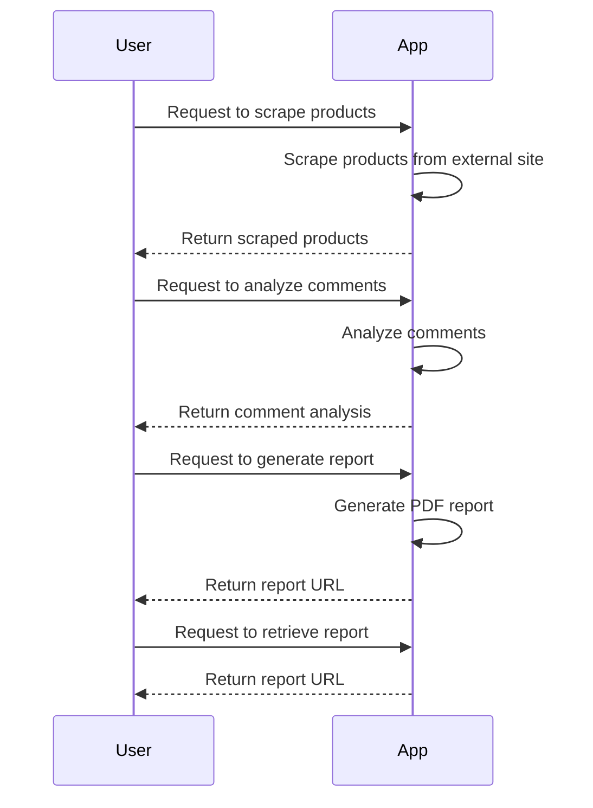

```markdown
# Functional Requirements Document

## Overview
The application will scrape product data from an online store, analyze comments, and generate a PDF report summarizing the average price by category and comment sentiment. Reports will be sent via email every Monday at 9 AM.

## API Endpoints

### 1. POST /scrape-products
- **Description**: Ingests product data by scraping the online shop.
- **Request Format**:
  ```json
  {
    "url": "https://magento.softwaretestingboard.com/"
  }
  ```
- **Response Format**:
  ```json
  {
    "status": "success",
    "message": "Products scraped successfully.",
    "data": [
      {
        "name": "Radiant Tee",
        "price": "$22.00",
        "category": "Apparel",
        "comments": [
          "Great quality!",
          "Fits perfectly."
        ]
      },
      ...
    ]
  }
  ```

### 2. POST /analyze-comments
- **Description**: Analyzes comments for sentiment and generates summaries.
- **Request Format**:
  ```json
  {
    "comments": [
      "Great quality!",
      "Fits perfectly."
    ]
  }
  ```
- **Response Format**:
  ```json
  {
    "status": "success",
    "summary": "Overall positive feedback.",
    "sentiment": {
      "positive": 80,
      "negative": 20
    }
  }
  ```

### 3. POST /generate-report
- **Description**: Generates a PDF report based on scraped data and analysis.
- **Request Format**:
  ```json
  {
    "product_data": [
      {
        "name": "Radiant Tee",
        "price": "$22.00",
        "category": "Apparel",
        "comment_summary": "Overall positive feedback."
      },
      ...
    ]
  }
  ```
- **Response Format**:
  ```json
  {
    "status": "success",
    "message": "Report generated successfully.",
    "report_url": "https://example.com/reports/report.pdf"
  }
  ```

### 4. GET /retrieve-report
- **Description**: Retrieves the generated report.
- **Response Format**:
  ```json
  {
    "status": "success",
    "report_url": "https://example.com/reports/report.pdf"
  }
  ```

## User-App Interaction Diagram


```mermaid
sequenceDiagram
    participant User
    participant App
    User->>App: Request to scrape products
    App->>App: Scrape products from external site
    App-->>User: Return scraped products
    User->>App: Request to analyze comments
    App->>App: Analyze comments
    App-->>User: Return comment analysis
    User->>App: Request to generate report
    App->>App: Generate PDF report
    App-->>User: Return report URL
    User->>App: Request to retrieve report
    App-->>User: Return report URL
```
```