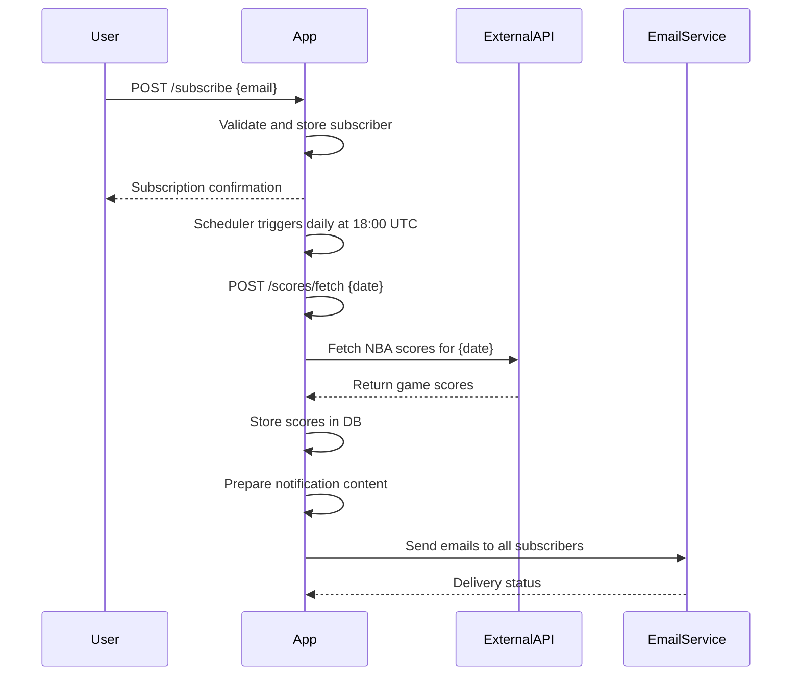
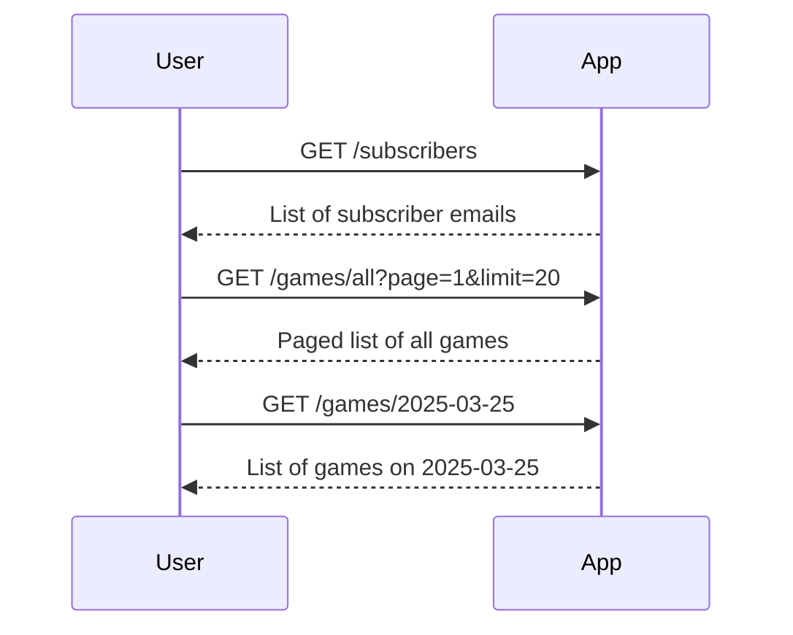

```markdown
# Functional Requirements for NBA Scores Notification Application

## API Endpoints

### 1. Subscribe User  
**POST /subscribe**  
- Purpose: Add a new subscriber email to the notification list.  
- Request Body (JSON):  
  ```json
  {
    "email": "user@example.com"
  }
  ```  
- Response (JSON):  
  ```json
  {
    "message": "Subscription successful",
    "email": "user@example.com"
  }
  ```  
- Business logic:  
  - Validate email format.  
  - Prevent duplicate subscriptions.  

---

### 2. Fetch and Store NBA Scores  
**POST /scores/fetch**  
- Purpose: Trigger fetching NBA scores from external API for a specific date, store locally, and send notifications.  
- Request Body (JSON):  
  ```json
  {
    "date": "YYYY-MM-DD"
  }
  ```  
- Response (JSON):  
  ```json
  {
    "message": "Scores fetched, stored, and notifications sent",
    "date": "YYYY-MM-DD",
    "games_count": 15
  }
  ```  
- Business logic:  
  - Call external API asynchronously to fetch scores for given date.  
  - Store results in local database.  
  - Send notification emails to all subscribers with summarized scores.  

---

### 3. Get All Subscribers  
**GET /subscribers**  
- Purpose: Retrieve list of all subscribed emails.  
- Response (JSON):  
  ```json
  {
    "subscribers": [
      "user1@example.com",
      "user2@example.com"
    ]
  }
  ```  

---

### 4. Get All Games  
**GET /games/all**  
- Purpose: Retrieve all stored NBA game data.  
- Optional Query Parameters:  
  - `page` (integer): for pagination  
  - `limit` (integer): items per page  
- Response (JSON):  
  ```json
  {
    "games": [
      {
        "date": "YYYY-MM-DD",
        "home_team": "Team A",
        "away_team": "Team B",
        "home_score": 100,
        "away_score": 98
      },
      ...
    ],
    "pagination": {
      "page": 1,
      "limit": 20,
      "total": 100
    }
  }
  ```  

---

### 5. Get Games By Date  
**GET /games/{date}**  
- Purpose: Retrieve all games played on a specific date.  
- Path Parameter:  
  - `date` (string, format YYYY-MM-DD)  
- Response (JSON):  
  ```json
  {
    "date": "YYYY-MM-DD",
    "games": [
      {
        "home_team": "Team A",
        "away_team": "Team B",
        "home_score": 100,
        "away_score": 98
      },
      ...
    ]
  }
  ```  

---

## User-App Interaction Sequence Diagram


```mermaid
sequenceDiagram
    participant User
    participant App
    participant ExternalAPI
    participant EmailService
    User->>App: POST /subscribe {email}
    App->>App: Validate and store subscriber
    App-->>User: Subscription confirmation

    App->>App: Scheduler triggers daily at 18:00 UTC
    App->>App: POST /scores/fetch {date}
    App->>ExternalAPI: Fetch NBA scores for {date}
    ExternalAPI-->>App: Return game scores
    App->>App: Store scores in DB
    App->>App: Prepare notification content
    App->>EmailService: Send emails to all subscribers
    EmailService-->>App: Delivery status
```

## User Request and Data Retrieval Flow


```mermaid
sequenceDiagram
    participant User
    participant App
    User->>App: GET /subscribers
    App-->>User: List of subscriber emails

    User->>App: GET /games/all?page=1&limit=20
    App-->>User: Paged list of all games

    User->>App: GET /games/2025-03-25
    App-->>User: List of games on 2025-03-25
```
```