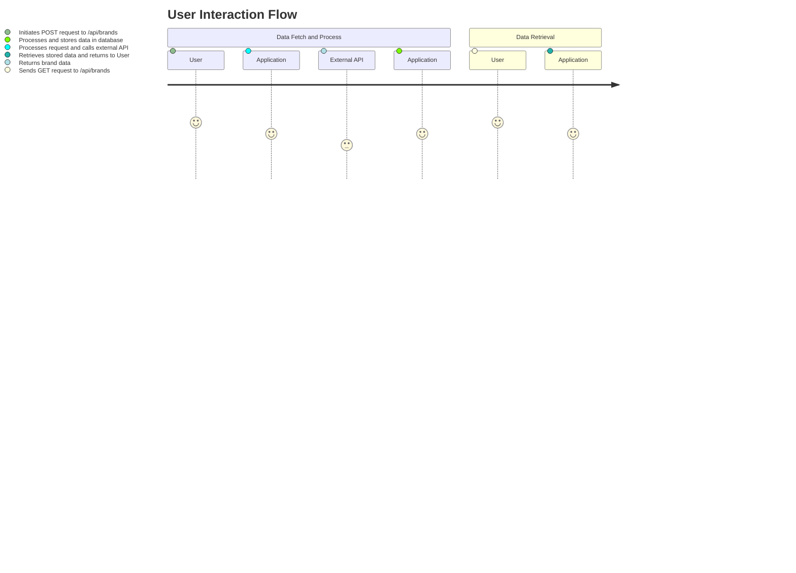
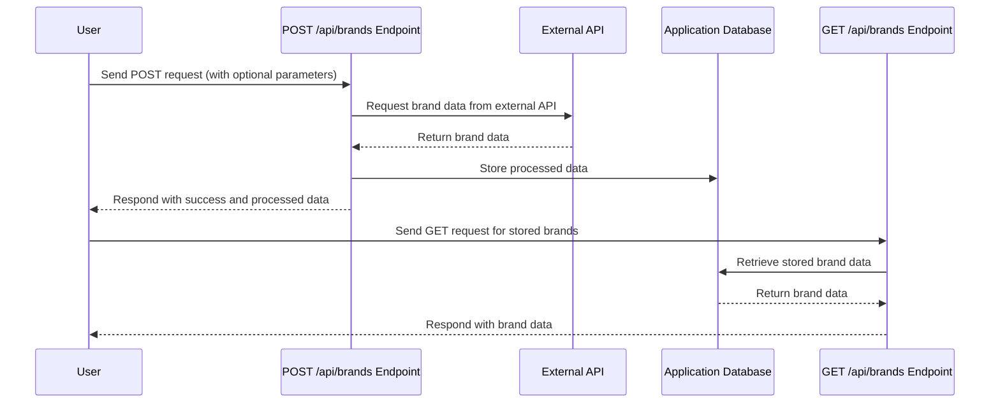

# Functional Requirements Document

## Project Overview
The application will retrieve data from an external open-source API and display the results to the user. External API calls and business logic will be handled through a designated POST endpoint, while the GET endpoint will be used solely for retrieving processed results.

## API Endpoints

### 1. POST /api/brands
- **Purpose:**  
  Invokes the external API (https://api.practicesoftwaretesting.com/brands) to fetch brand data, performs necessary business logic or calculations, and stores the processed results.

- **Request Format:**  
  - **HTTP Method:** POST  
  - **Request Body:** Optional parameters can be included for filtering or processing.
  
  **Example Request Body:**
  ```json
  {
    "filter": "active"
  }
  ```

- **Response Format:**  
  - **Status Code:** 200 OK (on success), 4xx/5xx (on error)  
  - **Response Body:**
  ```json
  {
    "status": "success",
    "data": [
      {
        "id": "01JMWZK3N7PT3XMTMXMQTBACRV",
        "name": "ForgeFlex Tools",
        "slug": "forgeflex-tools"
      },
      {
        "id": "01JMWZK3N7PT3XMTMXMQTBACRW",
        "name": "MightyCraft Hardware",
        "slug": "mightycraft-hardware"
      }
    ]
  }
  ```

### 2. GET /api/brands
- **Purpose:**  
  Retrieves the stored/processed brand data from the application’s database without re-invoking external API calls or business logic.

- **Request Format:**  
  - **HTTP Method:** GET  

- **Response Format:**  
  - **Status Code:** 200 OK (on success), 4xx/5xx (on error)  
  - **Response Body:**
  ```json
  {
    "data": [
      {
        "id": "01JMWZK3N7PT3XMTMXMQTBACRV",
        "name": "ForgeFlex Tools",
        "slug": "forgeflex-tools"
      },
      {
        "id": "01JMWZK3N7PT3XMTMXMQTBACRW",
        "name": "MightyCraft Hardware",
        "slug": "mightycraft-hardware"
      }
    ]
  }
  ```

## User Interaction Flow

### User Journey Diagram

```mermaid
journey
    title User Interaction Flow
    section Data Fetch and Process
      User: 5: Initiates POST request to /api/brands
      Application: 4: Processes request and calls external API
      External API: 3: Returns brand data
      Application: 4: Processes and stores data in database
    section Data Retrieval
      User: 5: Sends GET request to /api/brands
      Application: 4: Retrieves stored data and returns to User
```

### Sequence Diagram

```mermaid
sequenceDiagram
    participant U as User
    participant P as POST /api/brands Endpoint
    participant E as External API
    participant DB as Application Database
    participant G as GET /api/brands Endpoint

    U->>P: Send POST request (with optional parameters)
    P->>E: Request brand data from external API
    E-->>P: Return brand data
    P->>DB: Store processed data
    P-->>U: Respond with success and processed data

    U->>G: Send GET request for stored brands
    G->>DB: Retrieve stored brand data
    DB-->>G: Return brand data
    G-->>U: Respond with brand data
```

This document outlines the essential functional requirements for the project, including API specifications and user interaction flows.