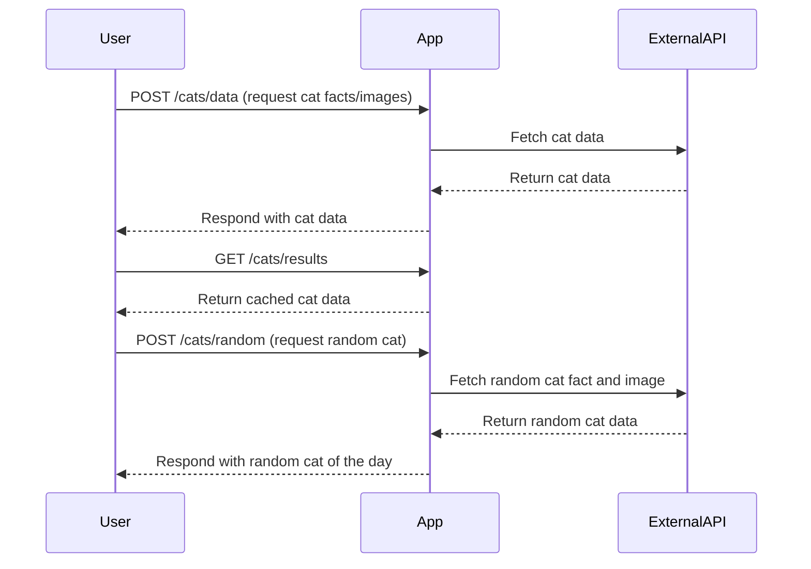

```markdown
# Purrfect Pets API - Functional Requirements

## API Endpoints

### 1. POST /cats/data
- **Purpose:** Fetch live cat data from external sources (facts, images, breeds).
- **Request Body:**
```json
{
  "type": "facts" | "images" | "breeds",
  "filters": {
    "breed": "string (optional)",
    "age": "string (optional)",
    "limit": "integer (optional, default 10)"
  }
}
```
- **Response:**
```json
{
  "status": "success",
  "data": [ /* array of cat facts/images/breeds depending on type */ ]
}
```

---

### 2. GET /cats/results
- **Purpose:** Retrieve previously fetched cat data results.
- **Response:**
```json
{
  "status": "success",
  "data": [ /* cached cat data from last POST request */ ]
}
```

---

### 3. POST /cats/random
- **Purpose:** Generate a "random cat of the day" using external data.
- **Request Body:** *(optional)*
```json
{
  "includeImage": true | false
}
```
- **Response:**
```json
{
  "status": "success",
  "cat": {
    "fact": "string",
    "image": "string (optional)"
  }
}
```

---

## User-App Interaction Sequence


```mermaid
sequenceDiagram
    participant User
    participant App
    participant ExternalAPI

    User->>App: POST /cats/data (request cat facts/images)
    App->>ExternalAPI: Fetch cat data
    ExternalAPI-->>App: Return cat data
    App-->>User: Respond with cat data

    User->>App: GET /cats/results
    App-->>User: Return cached cat data

    User->>App: POST /cats/random (request random cat)
    App->>ExternalAPI: Fetch random cat fact and image
    ExternalAPI-->>App: Return random cat data
    App-->>User: Respond with random cat of the day
```

---

## User Journey Overview

```mermaid
graph TD
    A[User] --> B[Request live cat data (POST /cats/data)]
    B --> C[App fetches data from external API]
    C --> D[App stores & returns data]
    A --> E[Retrieve stored cat data (GET /cats/results)]
    E --> F[Display cat data to user]
    A --> G[Request random cat (POST /cats/random)]
    G --> H[App fetches random cat data]
    H --> I[App returns random cat to user]
```
```